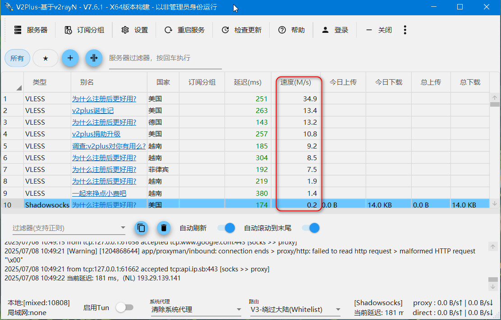

# 极速指南：1分钟拿下！

V2Plus作为一款便捷高效的翻墙软件，我们该如何使用它呢？

## 1.定位软件图标

在电脑桌面或开始菜单中找到V2Plus的快捷方式图标（通常显示为带有品牌标识的图案），如下图所示。双击该图标，等待主页面完全显示。

## 2.启动检测流程

成功进入软件后，无需登录，系统将自动触发网络检测模板，无需手动操作，静待一分钟，检测完成后，界面会显示实时速度数值，当速度值>0时，则证明可用，如图所示。

## 3.选择可用节点

在软件界面中，系统会列出所有可用的服务器节点，鼠标单击任意一个可用节点（推荐选择速度较快的节点），按下回车键确认选择。
成功连接后，在屏幕右下方的任务栏中会出现软件小图标，单击右键，找到”自动配置系统代理“，如图所示。

## 4.验证代理是否生效

打开浏览器，访问任意网站（如Google)，检查是否能正常加载，如果无法访问，请重新检查代理设置或切换其他节点再次尝试。

使用翻墙软件后，您可能会注意到切换回国内软件后网速速度有所下降，针对这一现象，不必担心！我们将在下篇文章中为您支招，教您如何快速解决这一问题！
