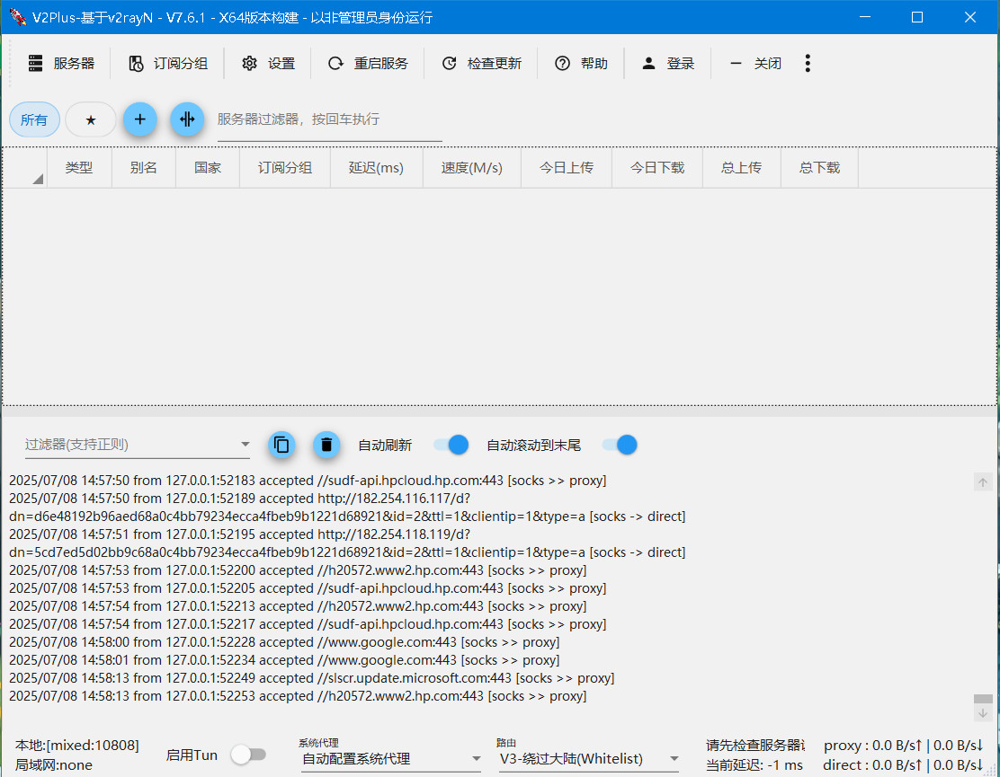
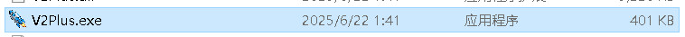

# 使用教程配置从入门到精通
V2Plus是Windows系统下的**免费**代理软件客户端，功能强大且支持多种代理协议，如VMess、VLESS、Trojan、Socks、Shadowsocks、Hysteria2、Tuic等代理协议。通过本文2025最新使用教程快速入门篇所掌握的技巧，能快速方便配置代理协议进行代理访问。

## 一、界面预览

（主界面）

## 二、下载

**V2Plus官网** ： [V2Plus - 专业稳定的科学上网梯子服务 | 翻墙VPN代理 - V2Plus科学上网](http://www.v2plus.xyz/)
下载地址： https://gofile.io/d/NbgZX8
备用地址： https://www.mediafire.com/file/7msuyqnxbl4ilmn/v2plus-windows-x64-0617.7z/file

## 三、安装教程

### 3.1 软件目录

下载完成后，找到合适的目录，推荐安装在非系统盘，解压压缩包。
软件为绿色免安装版，无需安装、无需配置、即开即用。
找到软件主程序 `V2Plus.exe` 双击鼠标左键即可开始使用。

程序启动后会最小化到任务右小角的托盘，鼠标双击蓝色的小火箭图标，即可打开软件的主界面。

### 3.2 图标说明

不同状态下软件的图标颜色是不一样的，参考下表图标颜色说明。

| 
图标
       | 
软件状态
     | 
说明
                  |
| ------------------------- | ------------------------- | ------------------------------------ |
|    | 
清除系统代理
   | 每次启动/重启服务的时候，强制把windows系统(ie)的代理清除掉。 |
|  | 
自动配置系统代理
 | 每次启动/重启服务的时候，强制设定windows系统(ie)的代理。   |
|   | 
不改变系统代理
  | 每次启动/重启服务的时候，什么都不做。作用就是保留其他软件设定的代理。  |

## 四、节点

节点即软件中的服务器，在使用之前，首先需要添加一个 **V2Plus节点** 即服务端才能使用代理上网功能，更多节点可参考本站 [节点订阅地址](https://v2rayn.org/v2rayn-node/) 或 [好用的V2Plus节点购买机场推荐](https://v2rayn.org/node/) 。

### 4.1 免费节点

由于软件支持VMess、VLESS、Trojan、Socks、Shadowsocks、Hysteria2、Tuic等代理协议，如需 **免费节点** 可以使用搜索引擎搜索。

### 4.2 收费节点

免费节点资源少或者觉得免费节点不稳定的话可以考虑购买收费节点。推荐搬瓦工官方机场 [Just My Socks](https://jmsnode.com/) ，支持 Shadowsocks 及 V2Ray 协议，并且多个数据中心及套餐可选。

技术小白建议购买机场，无需编写配置文件，直接导入节点订阅地址链接即可使用，机场推荐购买： [大哥云机场 (注册可免费试用！国内高速中转加密隧道，价格低至19.99元！)](https://v2rayn.org/dageyun/)

### 4.3 自己搭建节点

如果对稳定性要求高且有一定的技术基础，推荐自己搭建节点，速度有保证且安全性也最高，具体搭建教程可参考下面的链接。

- [V2Ray 搭建](https://www.linuxv2ray.com/) (VMess)
- [Xray 搭建](https://www.linuxxray.com/) (VLESS)
- [Trojan 搭建](https://www.linuxtrojan.com/)
- [Shadowsocks 搭建](https://www.linuxsss.com/) (SS)

## 五、添加服务器

获取节点服务器信息后，就可以开始添加服务器了，点击软件主界面的 `服务器` ，根据不同的节点添加不同的节点服务器。

（服务器设置 ）
### 六、订阅设置教程

一些代理机场往往会提供一个订阅地址，就可以使用订阅方式导入节点信息，点击软件主界面的 `订阅分组` ， `点击订阅分组设置` ，如下图所示：

（订阅分组）

在弹出的窗口中点击添加，如下图所示：

（添加订阅分组）

随后在弹窗的窗口中，输入别名，在 `可选地址(Url)` 部分粘贴订阅地址，点击添加，然后点击确定，如下图所示：

（订阅分组设置）

添加完成后，点击软件主界面的 `订阅分组` ，然后点击更新全部订阅(不通过代理)即可成功使用订阅地址添加节点信息，如下图所示：

（更新全部订阅）

### 6.1  剪贴板导入教程

首先复制节点服务器的连接地址，不同协议的地址如下所示。

- VMESS服务器即v2Ray节点地址： `vmess://`
- VLESS服务器即Xray节点地址： `vless://`
- Shadowsock服务器节点地址： `ss://`
- Socks服务器节点地址： `socks5://`
- Trojan服务器节点地址： `trojan://`

单机鼠标右键复制或者使用键盘快捷键 `Ctrl+C` 复制节点地址，注意一定要复制全。

（从剪贴板导入批量URL）

然后点击软件主界面的 `服务器` ，选择 **从剪贴板导入批量URL** 即可导入节点信息，如上图所示。

### 6.2 扫描屏幕二维码教程

首先打开服务器节点的二维码图片，然后打开软件，点击软件主界面的 `服务器` ，选择 **扫描屏幕上的二维码** 即可导入节点信息，如下图所示。

（扫描屏幕上的二维码）

### 6.3 配置V2Ray节点

点击软件主界面的 `服务器` ，选择 `添加[VMess]服务器` ，如下图所示。

（添加V2Ray节点）

在添加窗口输入V2Ray节点信息，即可配置V2Ray服务器信息，然后点击确定保存，如下图所示。

（配置V2Ray节点信息）

### 6.4 配置Xray节点

点击软件主界面的 `服务器` ，选择 `添加[VLESS]服务器` ，如下图所示。

（添加Xray节点）

在添加窗口输入Xray节点信息，即可配置Xray服务器信息，然后点击确定保存，如下图所示。

（配置Xray节点信息）

### 6.5 配置Shadowsocks节点

点击软件主界面的 `服务器` ，选择 `添加[Shadowsocks]服务器` ，如下图所示。

（添加Shadowsocks节点）

在添加窗口输入Shadowsocks节点信息，即可配置Shadowsocks服务器信息，然后点击确定保存，如下图所示。

（配置Shadowsocks节点信息）

### 6.6 配置Socks节点

点击软件主界面的 `服务器` ，选择 `添加[Socks]服务器` ，如下图所示。

（添加Socks节点）

在添加窗口输入Socks节点信息，即可配置Socks服务器信息，然后点击确定保存，如下图所示。

（配置Socks节点信息）

### 6.7 配置Trojan节点

点击软件主界面的 `服务器` ，选择 `添加[Trojan]服务器` ，如下图所示。

（添加Trojan节点）

在添加窗口输入Trojan节点信息，即可配置Trojan服务器信息，然后点击确定保存，如下图所示。

（配置Trojan节点信息）

### 6.8 配置Hysteria2节点

点击软件主界面的 `服务器` ，选择 `添加[Hysteria2]服务器` ，如下图所示。

（添加Hysteria2节点）

在添加窗口输入Hysteria2节点信息，即可配置Hysteria2服务器信息，然后点击确定保存，如下图所示。

（配置Hysteria2节点信息）

### 6.9 配置Tuic节点

点击软件主界面的 `服务器` ，选择 `添加[Tuic]服务器` ，如下图所示。

（添加Tuic节点）

在添加窗口输入Tuic节点信息，即可配置Tuic服务器信息，然后点击确定保存，如下图所示。

（配置Tuic节点信息）

## 七、使用教程

在添加完节点信息后，开启系统代理并选择路由模式，即可开始使用代理服务器上网了，如下面 **系统代理** 及 **路由模式** 章节所述。

### 7.1 选择节点

在软件主界面选择任意节点，单击鼠标右键，在弹出的窗口中扎到设为活动服务器即可选择节点，如下图所示，然后开启系统代理即可，也可以选择任意节点，双击鼠标左键选择节点。

（选择节点）

### 7.2 系统代理

按照上面的配置教程配置完服务器（节点）后，需要设置系统代理才能让浏览器支持科学上网功能，在任务栏右下角系统托盘找到软件的图标，在图标上 **单击鼠标右键** ，点击 **自动配置系统代理** ，此时软件的图标会标称 **红色** ，至此就可以开始使用了，打开 [Google](https://www.google.com/) 试试能不能访问吧。

（自动配置系统代理）

### 7.3 路由模式

路由的功能是将入站数据按需求由不同的出站连接发出，以达到按需代理的目的。这一功能的常见用法是分流国内外流量，可以通过内部机制判断不同地区的流量，然后将它们发送到不同的出站代理，有以下三种路由模式可以选择。

- 绕过大陆(Whitelist)模式：即原先版本里的白名单，只是白名单内的网站通过节点服务器代理上网
- 黑名单(Blacklist)模式：除了黑名单内的网站，其余网站都通过节点服务器代理上网
- 全局(Global)模式：所有网站通过节点服务器代理上网

根据不同的需求选择合适的路由模式，一般选择白名单模式。

（路由模式）

### 7.4 开机自动启动

在点击软件主界面的 `设置` ，点击 `设置` 然后点击 `参数设置` 进入参数设置页面，如下图所示：

（参数设置）

进入参数设置后，选择 `V2Plus设置` 标签页，勾选上开机自动启动复选框，然后点击确认，如下图所示。

（设置开机自启动）

## 八、更新教程

可在线自动更新软件、Xray-Core、sing-box Core、Geo files，通过点击软件主界面的 `检查更新` 进行在线更新，如下图所示。

（检查更新）

## 九、常见问题

core类型一共有四个，分别是v2fly、SgerNet、Xray、sing-box，一般日常使用没有任何区别，随意选择哪个都可以。

VMess、VLESS、Trojan、Socks、Shadowsocks、Hysteria2、Tuic等代理协议。

V2Plus 安卓手机版名为 v2rayNG，可移步至 [v2rayNG](https://v2rayng.org/) 下载并查看详细教程。

更多有关软件的问题可查看 [常见问题](https://v2rayn.org/v2rayn-faqs/) 。

## 十、最新更新

- [最新版 V2Plus 下载](https://v2rayn.org/v2rayn-download/)
