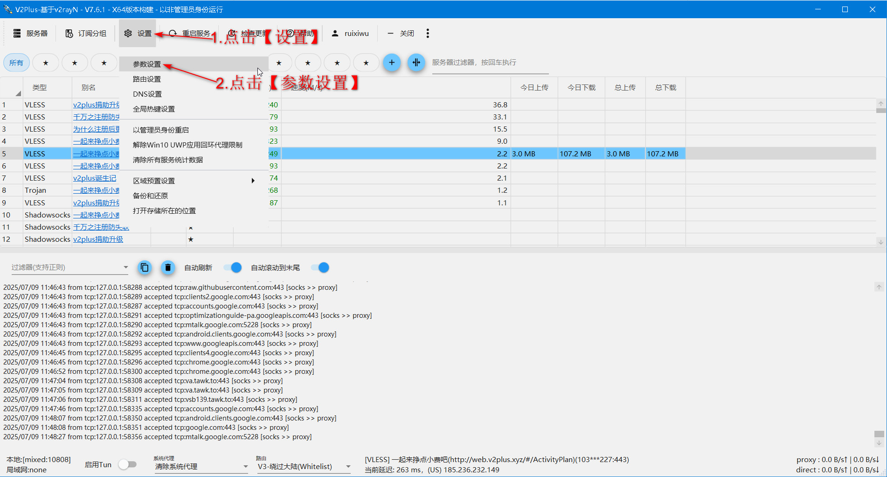
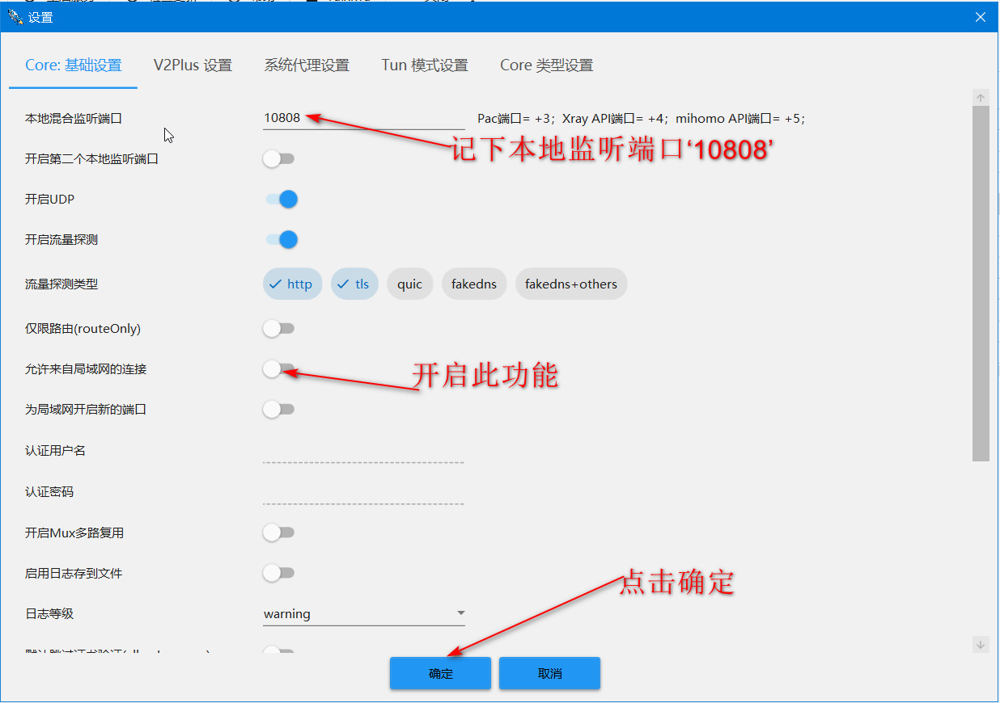
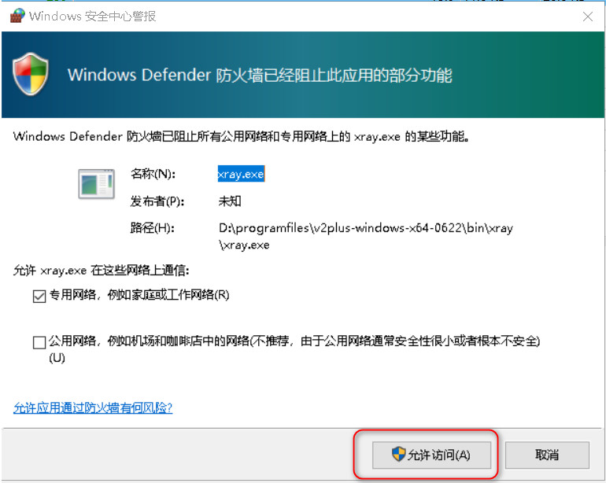
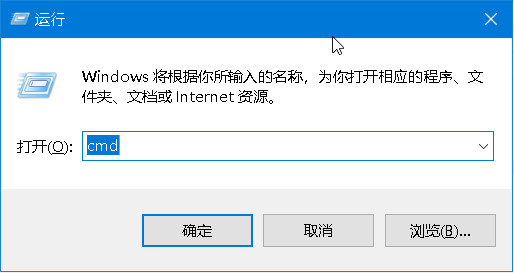
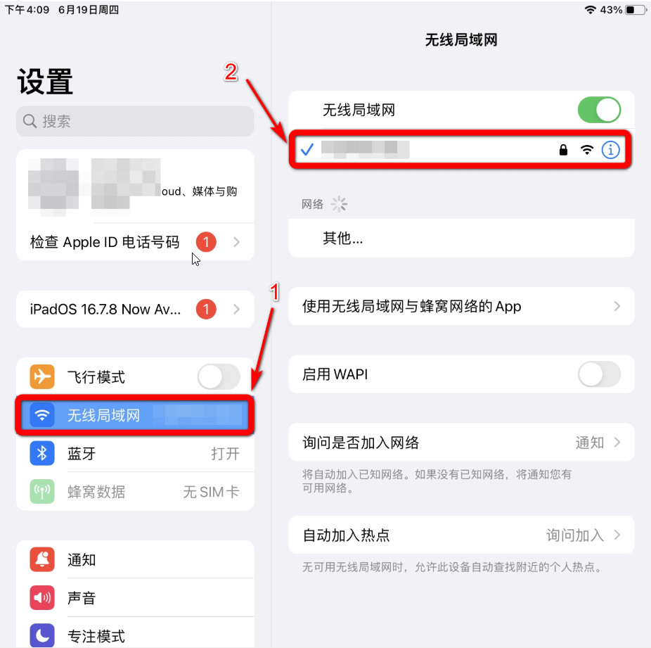
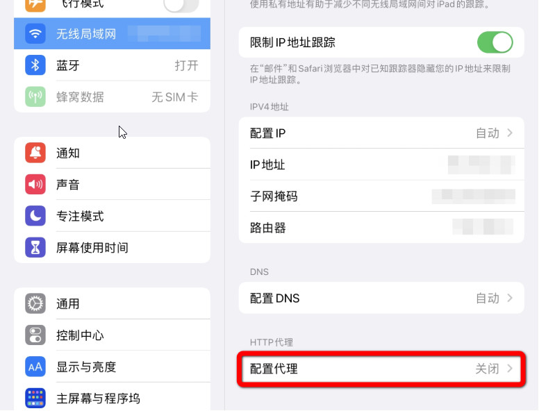
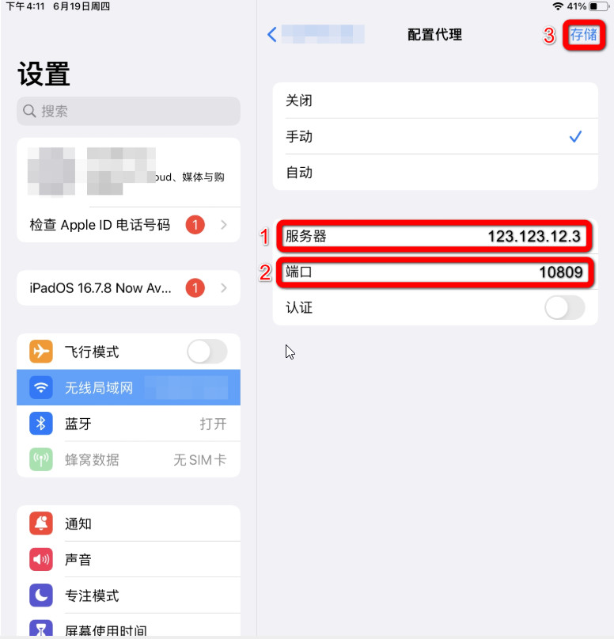
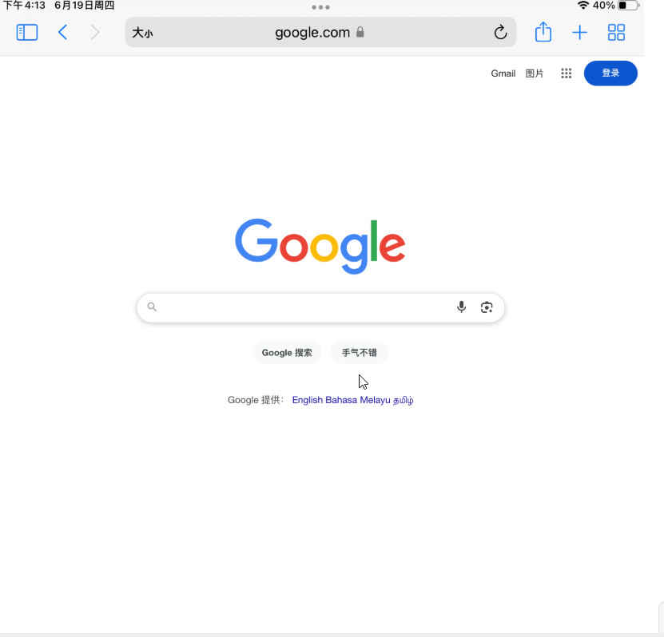

# V2PIus 之IOS使用教程

注：此方法需要手机和电脑连接在同一个局域网下

（1）在电脑上启动v2plus，点击“设置”，打开“参数设置” ，如图所示。

（2）然后开启“允许来自局域网的连接”功能，并记录下你的“本地监听端口”，点击“确定” 。

（3） 弹出“Windows安全中心”窗口后，点击“允许访问”。

 （4）获取你的局域网IP
         按下 `Win + R` 键，打开“运行”窗口。
        输入 `cmd`，然后按下回车，打开“命令提示符”。

         在命令行中输入此命令：`ipconfig`，然后按下回车
        记录下你的IPv4地址

（5）下面来到你的IOS设备上进行操作，首先打开“设置”，进入“WLAN”，并点击你正在连接的网络。

（6）点击"HTTP“代理”下的“配置代理”  。

（7）选择“手动”  
    a.在“**服务器**”处填入<步骤5>中记录下的“**IPv4地址**”；  
    b.在“**端口**”处填入<步骤2>中记录下的“**本地监听端口**”：  
    c.点击“**存储**”按钮

配置完成，让我们尝试在浏览器中输入www.google.com看它是否可以成功。

