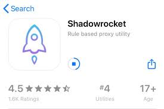
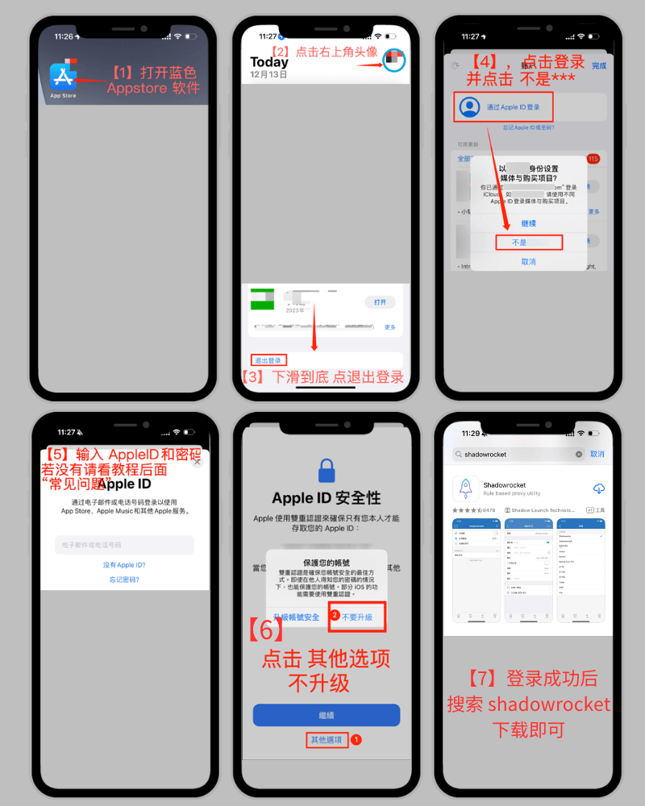
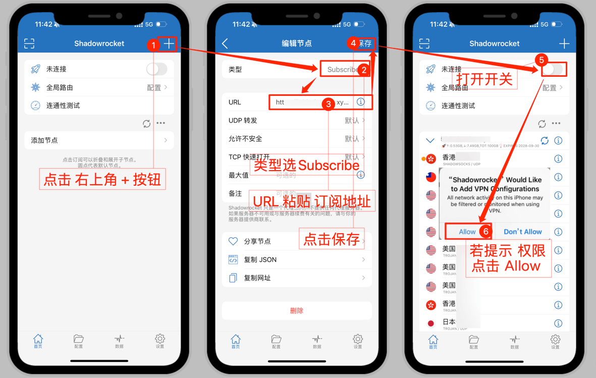

# V2PIus 之ios使用教程

Shadowrocket 是一款基于 iOS新特性的 Shadowsocks 客户端。它可以做到全局代理，也可以根据网站来进行分流。它可以满足你的绝大的需求！

## 一、下载安装

1.打开iPhone/iPad的蓝色 AppStore 软件（请不要打开设置）

2.右上角点击 个人头像 进入账户，下拉到最底找到并点击 退出登录

3.登录美区AppleID共享账号和密码（自备账号也行，要求已经购买过了2.99美元的shadowrocket)

4.点击登录，提示 Apple id安全 ，请点击 其他选项-不升级

5.搜索 shadowrocket 下载，或者其他你想下载的软件

6.用完务必 退出登录 ，避免你的手机被锁

## 二、使用教程

1.提前复制 **订阅地址** [**推荐订阅节点购买**](https://shadowrocket-app.gitbook.io/shadowrocket/all/buy)

2.打开 **shadowrocket** 软件，低下有4栏：**首页 配置 数据 设置**

3.shadowrocket软件 首页
     a.-> 右上角 +（进入添加节点页面）
    b. -> 类型 选 Subscribe
    c.-> URL 粘贴 订阅地址
    d.-> 点击右上角 完成 保存回到首页

4.点击底下4栏中的 设置 -> 服务器订阅 -> 打开 打开时更新 开关

5.完全杀掉退出 shadowrocket 软件，再重新打开，在首页 会自动更新订阅，（若没有更新，就手动点击一下服务器节点一栏） 此时你会看到节点，选择你心仪的节点，打开最上面的 未连接 开关(首次打开会弹窗提示安装vpn，请点击 Allow/同意 输入手机解锁密码），即可使用。

## 三、常见问题

1.shadowrocket 无法更新? 只能卸载重新安装，因为更新是要输入上次下载软件使用的Apple ID账号。

2.shadowrocket 全局路由选什么？默认选配置就行，基本满足99%用途。

3.shadowrocket 更新订阅提示 发生SSL错误? 一般是订阅地址被污染所致，请你复制订阅地址到浏览器看看是否能打开，若能打开证明订阅地址可以连接，打不开就是订阅地址域名被污染了，只有联系订阅地址发行方更换其他订阅地址。

## 四、**shadowrocket 一些高级用法**

- 关于首页的 **全局路由** 是什么意思？
    - “**配置**”为配置文件代理（即按照规则自动分流）
        
    - “**代理**”为全局代理（即所有连接均通过代理）
        
    - “**直连**”为绕过代理（即所有连接均不通过代理）
        
    - “**场景**”适用于不同网络环境下自动切换代理模式
        
因此得出总结，一般初级用户看不懂或者不会使用，务必选择 配置 模式

- 什么是更新订阅？如何更新订阅，可否设置自动更新？
    
    - 更新订阅就是重新从订阅地址获取最新可以使用的节点。
        
    - 软件首页，有一个 更新 图标按钮（双箭头包围成环形形状），点击即可更新。
        
    - 设置自动更新订阅直接去**设置** -> **服务器订阅** -> 打开 **打开时更新** 开关 和 **自动后台更新** 开关 即可。
        
- 如何查看我的订阅套餐，剩余时长，以及流量？
    
    - 软件首页 订阅一栏有小字，如下图。