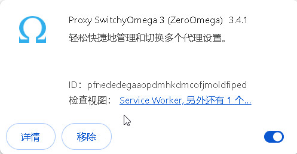
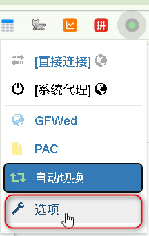
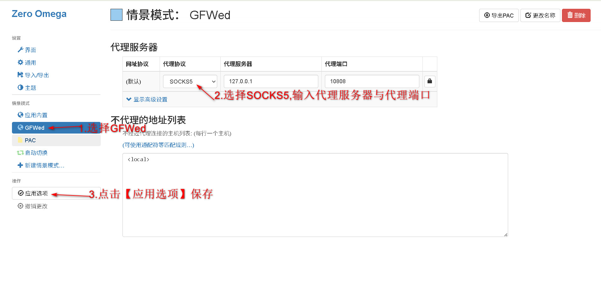
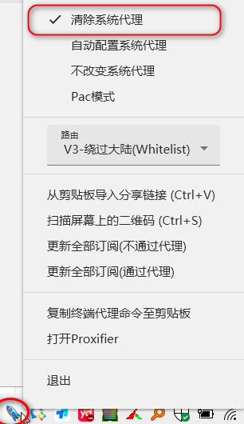

# 从困扰到解决：一步步教你应对！

上篇我们说到在使用V2PIus后，使用回国内一些网站后网络速度有所下降，针对这一现象，我们有如下几种方法进行改善。

打开浏览器，进入扩展程序管理页面，在扩展商店搜索Proxy SwitchyOmega 3

会出现两种结果’Proxy SwitchyOmega 3‘和’Proxy SwitchyOmega 3（ZeroOmega)‘，建议选择后者，点击’添加至Chrome‘安装。

安装成功后，点击插件图标，点击’选项‘。

选择’GFWed‘ → 选择’Socks5‘代理 → 输入代理服务器、代理端口的信息 → 点击 ’应用选项‘，完成设置。

运行’Proxy SwitchyOmega 3 (ZeroOmega)‘ → 选择’GFWed‘。于此同时，右击屏幕右下方任务栏中的小图标，选择’清除代理系统‘，图标颜色则会变成蓝色。

值得注意的是，情景模式中除了’GFWed‘，还有’PAC‘和’自主切换‘两种模式，那两者分别是什么意思呢？

**PAC模式** 是一种“自动代理配置”方式，是 **Proxy Auto-Config** 的缩写，PAC 模式通过一个 **PAC 脚本文件**（通常是 `.pac` 文件）来自动决定每个网站（URL）是否走代理，以及该用哪个代理，我们可以将自己常用的网站输入PAC脚本中。

但这种模式有明显几个缺点，

1. 性能影响：页面加载延迟

- 每次访问网站时，浏览器都需要运行 PAC 脚本来判断是否使用代理。
    
- 如果 PAC 文件逻辑复杂或体积较大，可能会引起 **明显的延迟**，特别是在低性能设备或访问大量不同域名时。
    

2. 规则匹配有限

- PAC 脚本只能根据 **URL 或域名** 来判断，**无法感知 IP 或其他高级网络信息**。
    
- 比如：`abc.com` 和 `cdn.abc.com` 是不同域名，需要你手动添加规则。
    

3. 调试困难

- PAC 文件中的脚本运行在浏览器内部，**调试不便**，出现错误不容易定位。
    
- 例如，拼写错误、语法问题可能导致 PAC 无效，但浏览器不一定会给你明确的报错提示。
    

4. 规则更新不方便

- 如果使用本地 PAC 文件，每次修改都需要手动更新。
    
- 使用远程 PAC 文件虽然可以自动更新，但：
    
    - 需要确保远程服务器稳定在线
        
    - 某些浏览器或网络环境下远程地址可能加载失败（比如被墙）

5. 仅作用于浏览器

- SwitchyOmega 的 PAC 模式只影响 **Chrome 浏览器的请求**。
    
- 系统中的其他应用（如 Steam、Dropbox、终端等）不会受此影响，除非你用系统级代理工具。
    

6. 不支持 HTTPS 域名的细粒度控制

- PAC 脚本对 HTTPS URL 的判断通常只能基于域名，**无法判断完整路径**，因为 HTTPS 是加密的。

而’自主切换‘模式则可以定义多个情景模式（直连、全局、某个代理等），然后根据规则自动选择其中之一。

’自主切换‘模式虽说比以上两个模式更便捷高效，也最推荐使用，但它也有两点小瑕疵，首先它无法精确控制 URL 路径或端口（只能按域名匹配），然后规则冲突时优先级不易发现，例如在多个规则都能匹配时，只有最靠前的生效。

