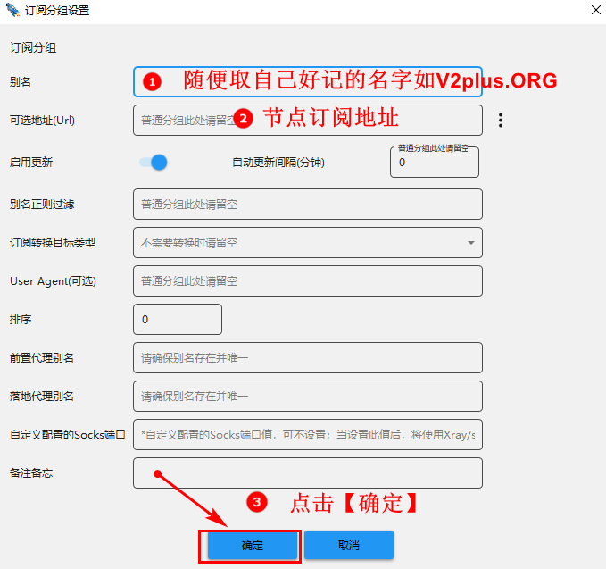
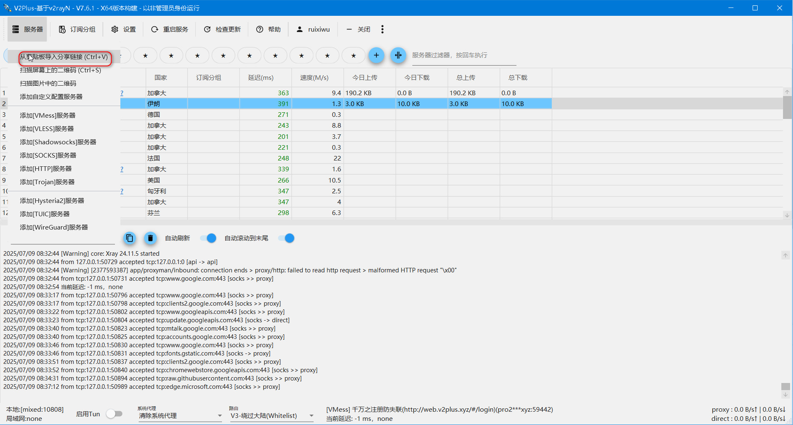
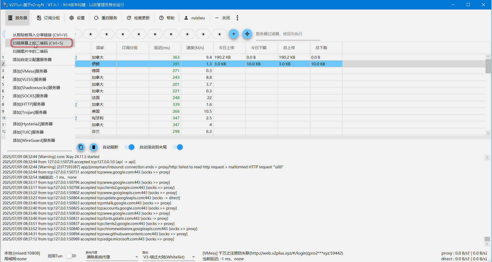
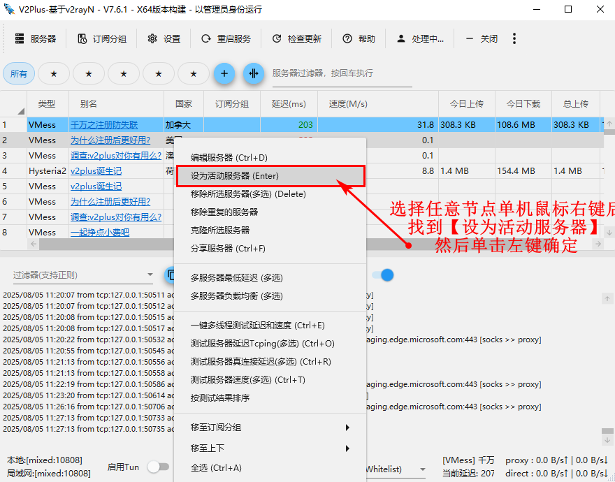
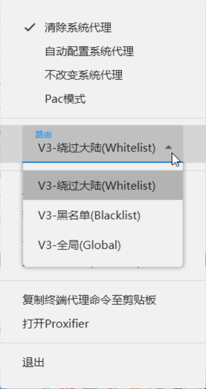
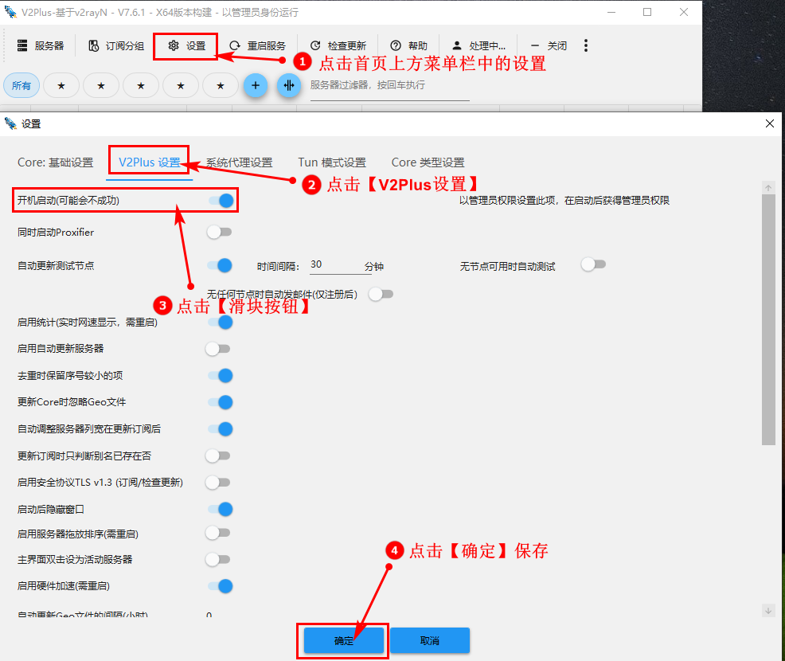

## 节点配置

### [免费](https://www.haovps.top/tag/%E5%85%8D%E8%B4%B9/ "免费")节点

通过[搜索引擎](https://www.haovps.top/tag/%E6%90%9C%E7%B4%A2%E5%BC%95%E6%93%8E/ "搜索引擎")获取免费节点，支持 VMess、VLESS、Trojan、Socks、Shadowsocks 等协议。

### 收费节点

推荐使用 [Just My Socks](https://www.haovps.top/go/aHR0cHM6Ly9qbXNub2RlLmNvbS8) 或 [大哥云机场](https://www.haovps.top/go/aHR0cHM6Ly92MnJheW4ub3JnL2RhZ2V5dW4v)，支持 Shadowsocks 及 [V2Ray](https://www.haovps.top/tag/V2Ray/ "V2Ray") 协议，稳定性更高。

### 自建节点

如需更高稳定性，可参考以下教程自建节点：

- [V2Ray 搭建](https://www.haovps.top/go/aHR0cHM6Ly93d3cubGludXh2MnJheS5jb20v) (VMess)
- [Xray 搭建](https://www.haovps.top/go/aHR0cHM6Ly93d3cubGludXh4cmF5LmNvbS8) (VLESS)
- [Trojan 搭建](https://www.haovps.top/go/aHR0cHM6Ly93d3cubGludXh0cm9qYW4uY29tLw)
- [Shadowsocks 搭建](https://www.haovps.top/go/aHR0cHM6Ly93d3cubGludXhzc3MuY29tLw) (SS)

## 添加[服务器](https://www.haovps.top/tag/tag-3985df2e6400657cc8388614aefd5def/ "服务器")

### 订阅设置

1. 点击主界面的 `订阅分组`，选择 `订阅分组设置`。
2. 点击 `添加`，输入别名和订阅地址，点击 `确定`。
3. 点击 `更新全部订阅`，完成节点导入。

### 剪贴板导入

1. 复制节点地址（如 `vmess://` 或 `vless://`）。
2. 点击主界面的 `服务器`，选择 `从剪贴板导入分享链接`。
3. 

### 扫描二维码

1. 打开节点二维码图片。
2. 点击主界面的 `服务器`，选择 `扫描屏幕上的二维码`。

## 使用教程

### 选择节点

1. 在主界面选择节点，右键点击 `设为活动服务器`。
2. 开启系统代理，图标变为红色即可使用。
3. 

### 路由模式

- ​绕过大陆 (Whitelist)​：仅代理白名单内的网站。
- ​黑名单 (Blacklist)​：代理除黑名单外的所有网站。
- 全局 (Global)​：代理所有流量。

### 开机自启动

1. 点击主界面的 `设置`，选择 `参数设置`，点击V2Plus设置。
2. 勾选 `开机自动启动`，点击 `确认`。

