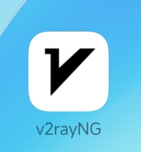
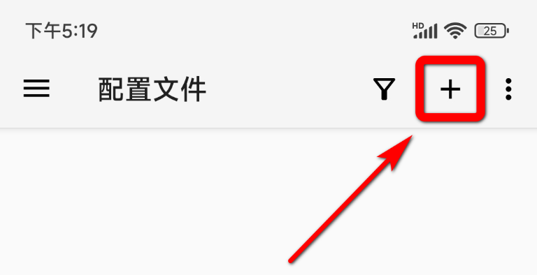
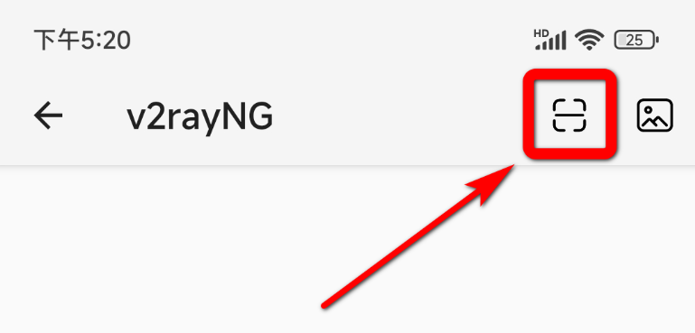
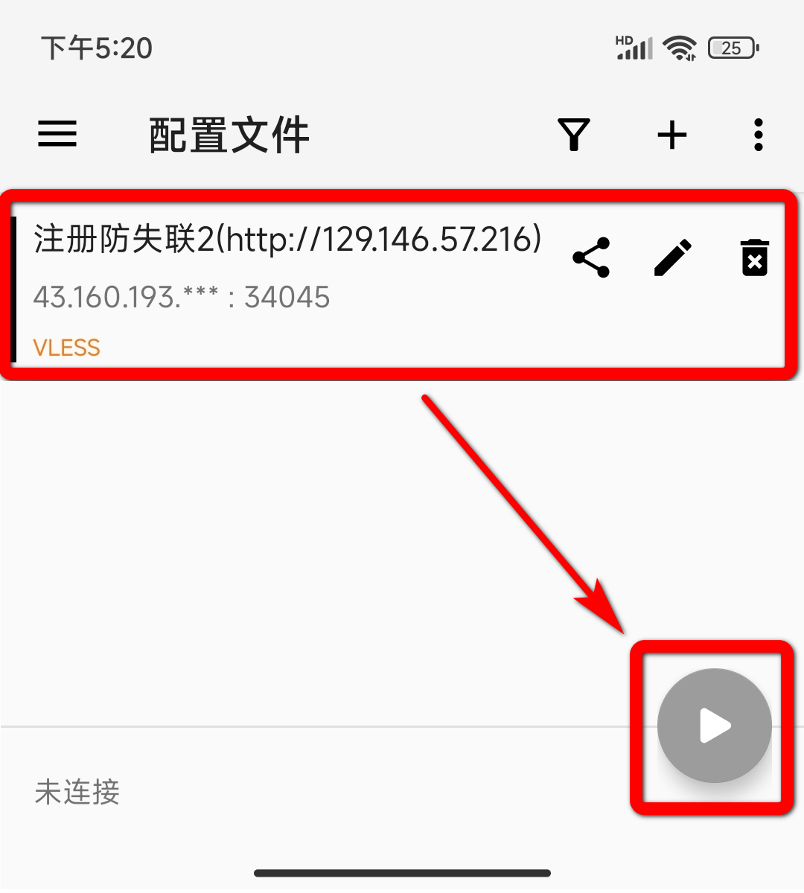
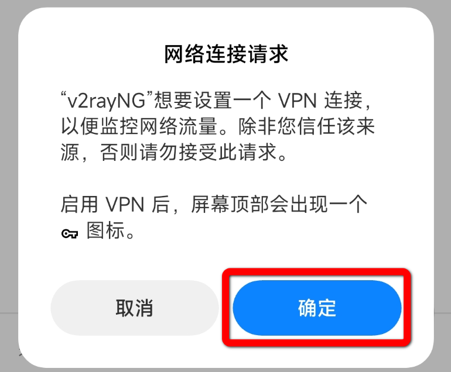

## 下载v2rayNG共享电脑端的订阅

1. 使用手机浏览器打开以下网址：[https://github.com/2dust/v2rayNG/releases](https://github.com/2dust/v2rayNG/releases "https://github.com/2dust/v2rayNG/releases")  
    下滑找到“Latest”（最新版）  
    点击下载通用安装包  
    如果你的网络暂时无法访问GitHub，请下载网盘链接中提供的文件（_链接_）  
    
    
2. 安装后你的手机桌面上就出现了这款软件，打开它  
    
    
3. 现在让我们回到电脑上，打开V2Plus，单击选择一个可用的节点  
    
    
4. 直接按下快捷键`ctrl + F`，或者右键单击节点，选择”分享服务器“  
    
    
5. 此时屏幕上出现了一个二维码  
	
	
6. 现在回到手机上的v2rayNG，点击右上角的加号  
    
    
7. 点击”扫描二维码“  
    
    
8. 点击右上角的扫描图标，然后扫描电脑屏幕上的二维码  
    
    
9. 此时你的安卓手机就获取到了电脑上分享的节点，点击右下角的运行按钮  
    
    
10. 初次使用需点击”确定“以启用VPN  
    
    
11. 看到手机状态栏出现了VPN图标，意味着你已经成功接入了从电脑上获取的节点。试着访问一下www.google.com
    
成功！
- 如果VPN已经启动，却无法正常访问谷歌。这可能是节点的问题，请尝试在电脑上分享一个可用的节点到手机上来进行连接。