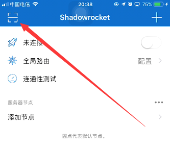
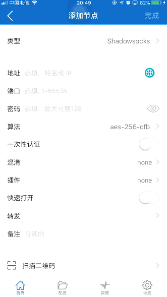

# iOS通过SS扫码V2Plus上网教程

## 一、前言

在iOS设备上，通过SS（Shadowsocks）扫码V2Plus实现科学上网是一种便捷且高效的方法。V2Plus是一种强大的代理工具，支持多种代理协议，包括Shadowsocks（SS），能够帮助用户绕过网络限制，自由访问全球网络资源。

## 二、准备工作

1. **获取V2Plus节点信息**：你可以从付费服务商（机场）购买V2Plus节点信息，也可以自己搭建VPS服务器并部署V2Plus核心。

2. **下载安装客户端**：在iOS设备上，需要将App Store账号切换到其他地区（如美区、港区等），搜索并下载支持SS和V2Plus的客户端，如Shadowrocket（小火箭）。下文以Shadowrocket为例，来进行说明。

## 三、通过SS扫码添加V2Plus节点

如果你有节点的二维码，可直接点击小火箭左上角的扫码按钮，软件可自动识别并添加。

1. **打开客户端**：安装完成后，打开Shadowrocket客户端。
2. **添加节点**：点击右上角的“+”号，选择“二维码”。
3. **扫描二维码**：将你的设备摄像头对准V2Plus节点的二维码，这个二维码通常是由你的V2Plus节点提供商生成的，它包含了节点的详细配置信息，如服务器地址、端口、加密方法、密码等。扫描后节点信息将自动添加到客户端。
4. **保存并命名**：扫描完成后，为该节点命名并保存。

## 四、复制节点连接导入

如果你没有节点的二维码，可以通过直接复制节点链接的方法来导入。

节点链接通常以 ssr:// 或者 vmess:// 这类的字符为开头，后面又跟着很多字符。我们直接复制节点链接，打开小火箭，软件会自动侦测剪贴板内容并识别节点信息，弹窗询问是否保 存，点击确认即可。

## 四、连接V2Plus节点

1. **选择节点**：回到主界面，点击你添加的节点。
2. **启动连接**：点击右上角的“开关”按钮，连接成功后，状态栏会出现VPN图标，表明已开始代理。

## 五、进阶设置

1. **自动更新订阅**：如果机场支持一键导入，可以直接在手机上按“一键导入Shadowrocket配置”。如果不支持，可以复制订阅链接粘贴到手机的Shadowrocket里，并设置“打开时更新”和“自动后台更新”。
2. **规则设置**：在Shadowrocket中，你可以设置全局路由，选择“配置”模式，让国内网站直连，国外常用网站走代理。此外，还可以通过添加规则文件，实现更精细的流量控制。

通过以上步骤，你就可以在iOS设备上通过SS扫码V2Plus实现科学上网了。希望这篇教程对你有所帮助。