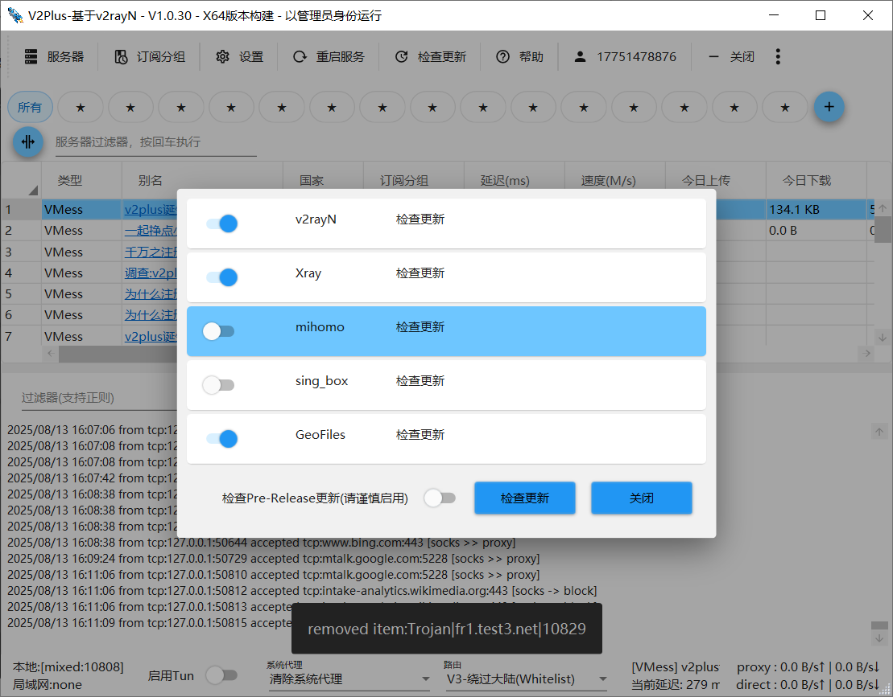
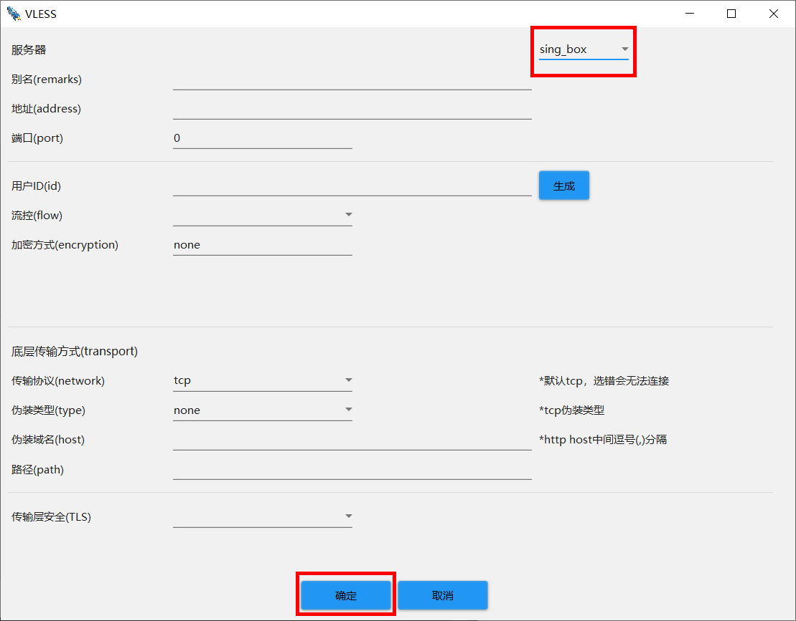
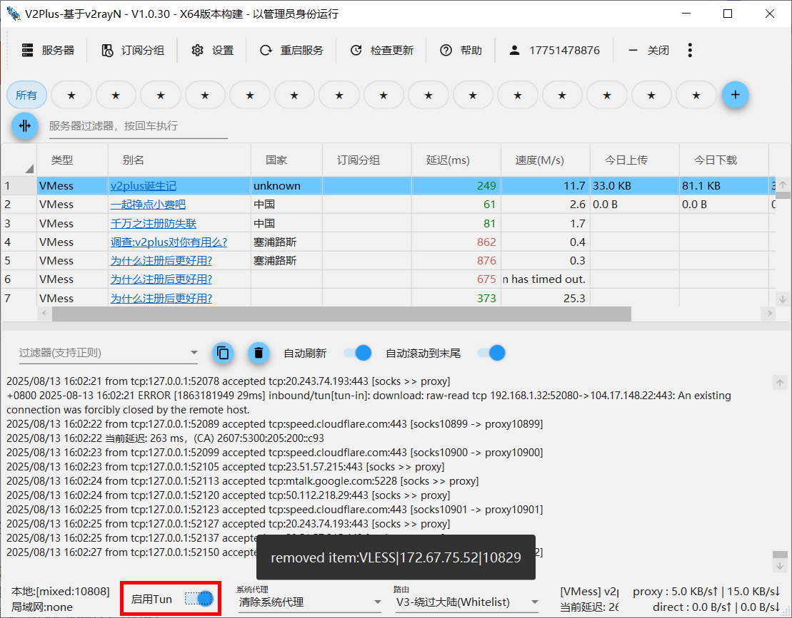
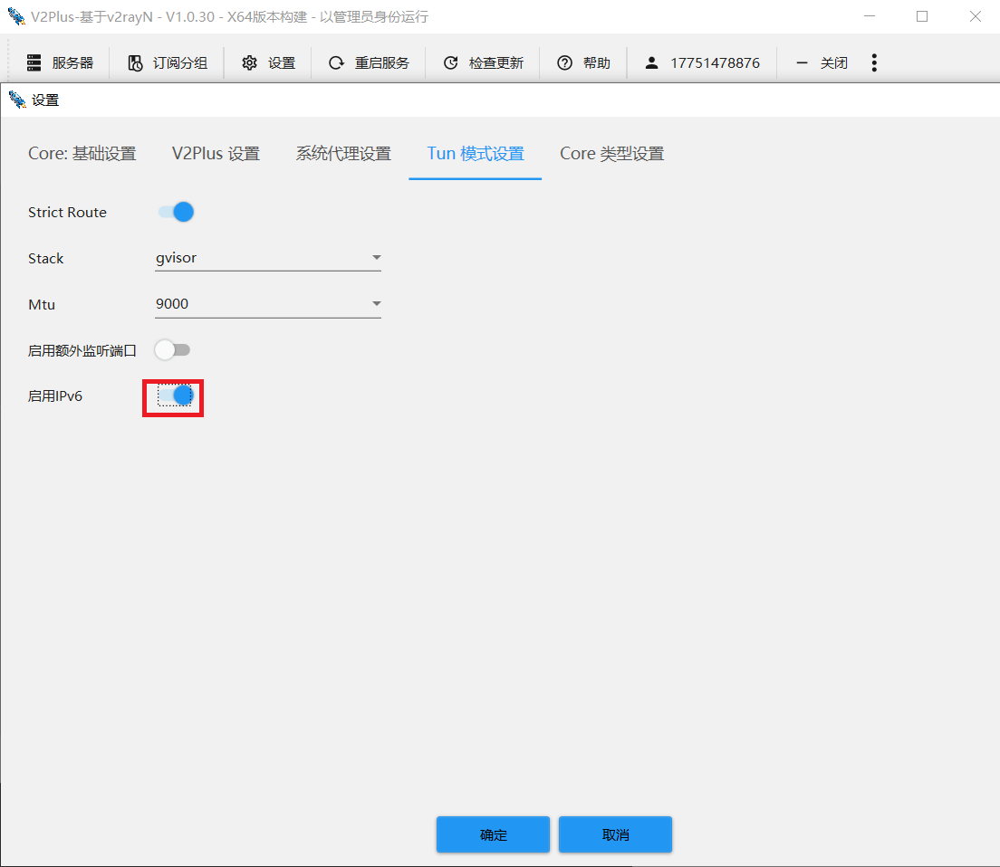
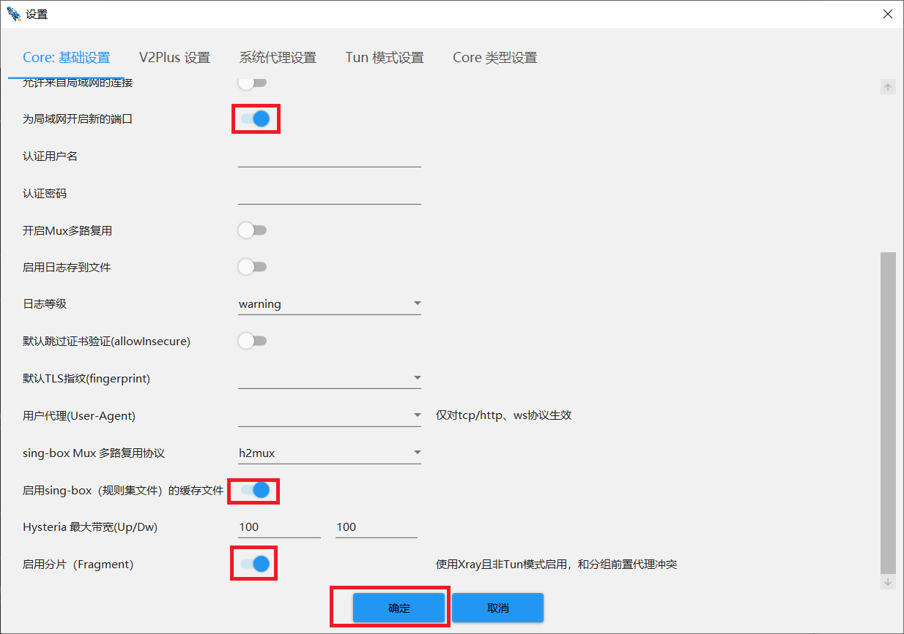
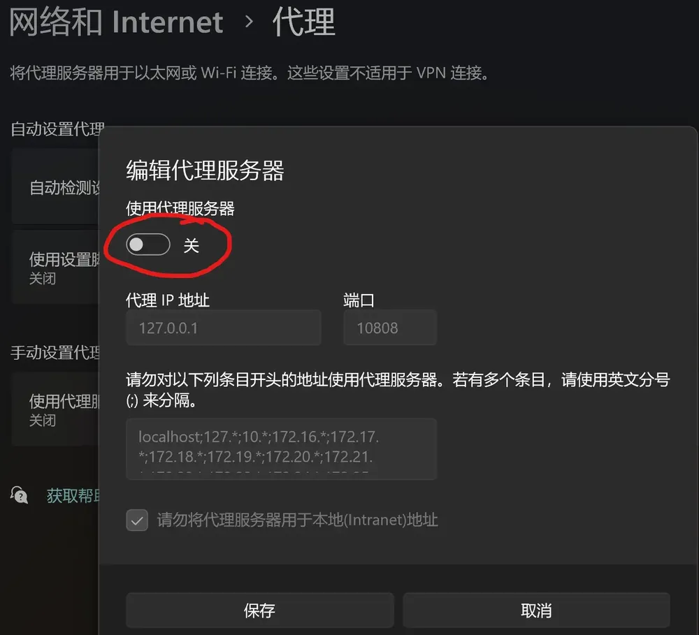
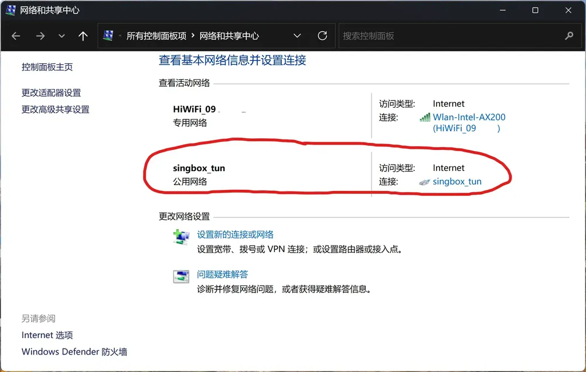
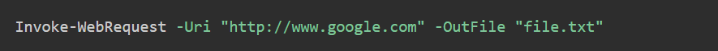

# 深入理解V2Plus Tun：配置与使用指南

## 1、什么是TUN模式？

 **TUN模式** 
Tun模式是一种网络隧道技术，主要用于VPN（虚拟专用网络）中的数据包传输。它的主要作用是将网络流量通过一个虚拟网络接口进行转发，从而实现对网络流量的控制和管理。

**工作原理**
Tun模式通过创建一个虚拟网络接口，将所有流量重定向到这个接口，然后通过代理服务器或VPN服务器进行处理。这样可以实现对网络流量的透明代理和加密传输。

**主要用途**
1. 网络代理：Tun模式可以将所有网络流量通过代理服务器进行转发，从而实现对网络访问的控制和管理。例如，可以通过Tun模式将所有流量转发到一个代理服务器，以实现对特定网站的访问控制。

2. VPN：Tun模式常用于VPN中，通过加密隧道将所有流量传输到VPN服务器，从而实现对网络流量的加密和保护。这对于保护用户隐私和安全非常重要。

3. 网络调试：Tun模式还可以用于网络调试和分析，通过将流量重定向到特定的服务器或工具，进行详细的流量分析和调试。

**优点**

1. 透明代理：Tun模式可以实现对所有网络流量的透明代理，无需对应用程序进行任何修改。

2. 加密传输：通过VPN实现对网络流量的加密传输，保护用户隐私和安全。

3. 灵活性：可以根据需要配置不同的代理服务器或VPN服务器，实现对网络流量的灵活控制。

## 2、配置V2Plus Tun操作步骤

配置 V2Plus tun 是实现科学上网的关键。以下是详细的配置步骤：

事实上V2Plus 客户端只是各种代理工具的 GUI 工具，本身并不实现核心代理功能。V2Plus 支持的 Tun 模式代理客户端是 sing-box。由于 sing-box 目前没有 windows 版的 GUI 工具，并且其配置文件比较复杂晦涩，很难一次性配置正确，所以 V2Plus 是更好的选择。

因此先点击更新，确保sing-box更新到最新版本。由于还要使用GeoFiles,所以这个也要更新下。

V2Plus点击你要使用的当前代理节点，将下图所示的节点配置Core类型改为sing_box, 并确认你使用的是这个改过的节点。注：20250310更新，使用xray+sing_box双核之前可以，最近不行了，随意要将代理和透明代理都改为sing_box。

回到V2Plus的主界面，点击下方的启用Tun，稍等片刻即可使用。

此时，访问国外网站，已经没有问题，如果访问国内网站速度慢，这是因为sing_box要用的分流规则没有更新所致，连接要等到超时，才会回落到代理方式，耽误了时间。

解决办法是执行更新，此时应保持tun打开状态，然后点击 检查更新，将其他的更新都取消（不取消也会更新失败，系统默认使用本地代理端口10808，tun模式并不可用），仅更新geofiles. 可以看到同时下载了默认的规则文件和sing_box的规则文件。

下载完成后，重启服务，此时访问国内网站baidu.com,qq.com速度都很快。

以下是相关的一些配置

启用Sing_box规则集文件

## 3.验证Tun模式，

 关闭系统代理，打开浏览器，看是否能访问google.com

路径：Windows设置-》网络和Internet-》代理

 打开网络和共享中心，看是否有以下虚拟网卡

 运行cmd,执行ping，看是否能ping通google.com

Powershell执行下面命令，如果没有报错，就会在当前文件夹生成file.txt文件，这说明代理有效。

## 3、使用V2Plus Tun的注意事项

在使用 V2Plus tun 的过程中，有几点需要特别注意：

确保你的网络连接正常，避免因网络不稳定导致的连接失败。 定期更新 V2Plus 和配置，确保使用的是最新的安全性和功能。 注意遵守当地的法律法规，合理使用代理工具。 常见问题解答（FAQ） 。

1. V2Plus与其他代理工具相比有什么优势？ V2Plus 提供更灵活的配置和多样化的协议支持，相较于传统的代理工具，它能更好地应对复杂的网络环境。
2. 使用TUN模式后速度变慢了怎么办？ 可以尝试更换不同的服务器，或者检查本地网络状况。如果问题仍然存在，可以考虑优化 DNS 设置。
3. 如何判断 V2Plus Tun 是否正常工作？ 可以通过访问被屏蔽的网站或使用在线测速工具来检查连接是否正常，成功访问即表示 Tun 工作正常。 
4. V2Plus Tun 是否会泄露用户隐私？ 使用 TUN 模式时，建议配置合适的加密协议和防火墙，尽量避免潜在的隐私泄露。 

## 4、结论

通过本文的详细讲解，我们深入了解了 V2Plus tun 的使用与配置。希望用户们能够借助这个工具，畅享更自由、安全的互联网体验。无论是为了工作、学习还是娱乐，合理利用 V2Plus tun 将会为你的上网生活带来巨大的便利。
