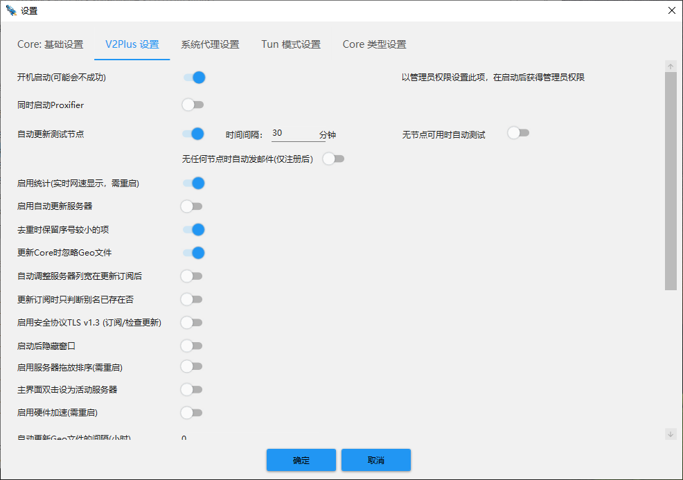
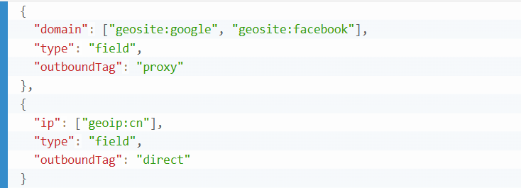
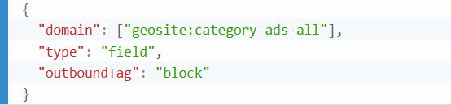

# V2Plus路由模式详解

## 1、路由模式类型

V2Plus 提供多种流量控制模式，适用于不同使用场景。

**绕过大陆及局域网模式** 是大多数用户首选的智能分流方式，它会自动识别并直连中国大陆的 IP 和局域网流量，而将国外网站的访问请求通过代理服务器转发。这样既能保证国内网站的访问速度，又能顺利访问被屏蔽的国际站点，如 Google、YouTube 等，非常适合日常使用。

**全局代理模式** 是一种将所有网络请求（包括国内与国外）都强制通过代理服务器转发的方式。虽然能确保所有流量都经过加密通道，有效应对防火墙干扰，但同时也会让访问国内网站时的速度明显变慢，并消耗大量代理流量，通常只建议在封锁严重或调试代理时使用。

**仅代理被屏蔽网站模式** 则更为克制，它仅对已知被 GFW 屏蔽的网站或服务进行代理，而将其他未屏蔽的内容直连。这种方式能更好地保留直连速度优势，同时节省代理流量，不过由于依赖规则库的完整性，如果规则更新不及时，可能导致部分被封网站无法正确访问。

**自定义规则模式** 提供了最大自由度，适合有技术基础的高级用户。你可以通过配置域名、IP、端口、协议等条件，精细控制哪些流量走代理、哪些直连，甚至设置不同流量走不同节点，用于实现多节点负载、特定程序分流等高阶操作，非常适合进阶用户定制化需求。

## 2、如何设置 V2Plus 路由模式？

#### 步骤 1：打开 V2Plus 客户端

- 确保你已成功导入节点（通过订阅或手动添加）
- 右键任务栏图标 → 选择【路由模式】

#### 步骤 2：选择预设路由模式

- 常见选项包括：
    - 绕过大陆及局域网（推荐）
    - 全局模式
    - 仅代理被屏蔽网站
    - 自定义规则（需要配合配置文件）

选择后立即生效，不需重启客户端。

#### 步骤 3：启用系统代理模式

- 在客户端主界面点击“启用系统代理”
- 推荐使用“自动配置系统代理 PAC”方式（灵活、高兼容）

#### 步骤 4：测试路由是否生效

- 打开国内网站（如淘宝、知乎）测试是否直连快速。
- 再打开国外网站（如 YouTube、Twitter）验证代理是否生效。
- 可使用 V2Plus 的“测试延迟”、“连接测试”功能进行辅助判断。

## 3、自定义路由规则配置

默认规则已能满足大多数需求，但若你有特殊用途，如特定网站不走代理或仅为特定程序代理流量，则可使用“自定义规则”功能。

#### V2Plus 支持的路由维度：

- **geosite**：基于域名分类（如 google、netflix、cn 等）
- **geoip**：基于 IP 区段归属（如 geoip:cn 表示中国 IP）
- **domain**：指定单个或多个域名（可支持通配符）
- **ip**：指定单个或多个 IP 或网段
- **port**：端口规则匹配
- **protocol**：指定协议（如 bittorrent、http、tls 等）
#### 示例规则写法（路由规则设置 → 自定义规则）：

你也可以添加一个“bypass 广告”规则：

