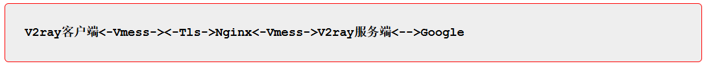
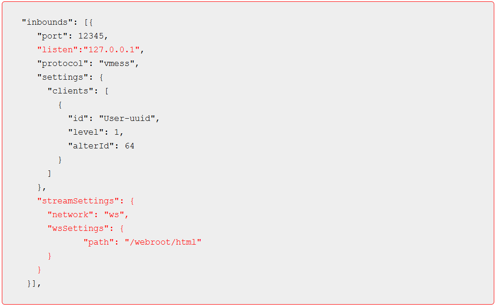
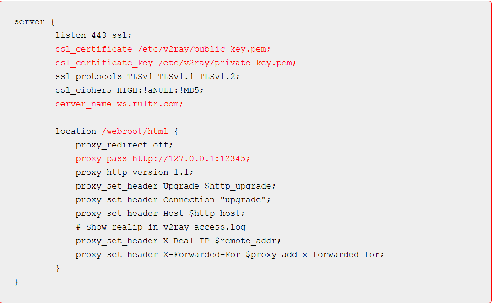

# V2Plus+WebSocket+Tls+Nginx 实现高伪装

所谓的高伪装，当然是针对 GFW 来说。普通 V2Plus客户端同服务器使用 TCP 方式连接，虽然在传输过程中使用 Vmess 协议对数据进行了加密操作，让 GFW 不能识别数据包的内容，但是由于固定连接某些主机的特定端口，也容易被标记为可疑数据，造成服务端被屏蔽。

而 V2Plus+WebSocket+Tls+Nginx 的方式就相对更具隐蔽性，客户端将代理数据进行 Vmess 加密，并将数据伪装成普通的 Web 请求，再通过 Tls 进行传输层加密，到达服务端后由 Nginx 响应请求，并将请转发给 V2Plus服务端，服务端对数据进行解密后，代理访问目标网站，并将目标网站的数据响应反馈给 Nginx，由 Nginx 转发给V2Plus客户端面，从而实现数据的代理。流程如下：

可以看出，用户数据在整个代理环节中会进行两次加密，并且在传输过程中与普通的 HTTPS 流量一致，由 Nginx 完成请求响应，极大的提升了数据的隐蔽性。其实现方法与 Trojan 基本一致，只是 V2ray 的 WebSocket 方案需要有 Web 服务器来配合完成。

首先配置 V2ray 服务器的 Vmess 协议采用 Websocket 方式传输：

其中标红的内容就是服务器使用 WebSocket方式时需要添加的内容：

“listen”是指 V2ray 侦听的主机，也就是接收 Nginx 转发请求的主机，一般采用本机即可 “streamSettings”表示数据流设置
 “network”表示数据流的网络设置，WebSocket方式时设置为”ws”
“wsSettings”是工作于 ws 方式时的设置项
 “path”: “/webroot/html”是指 Nginx 服务器转发请求网站的根目录

然后就需要配置 Nginx 启用 Tls 传输并将请求转发给 V2ray 服务端：

Nginx 的配置中标红部分为需要根据实际情况修改的内容：

ssl_certificate 为Web服务器的公钥
ssl_certificate_key 为Web服务器的私钥
server_name 为Web服务器侦听的主机名示例使用”ws.rultr.com”
location 为主机文件的实际目录，需要与 V2ray 服务端保持一致
proxy_pass 为转发请求的目标网址，需要与 V2ray 服务端对应。