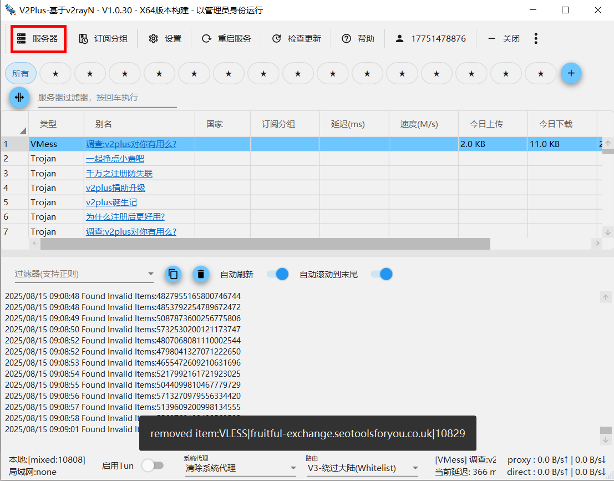
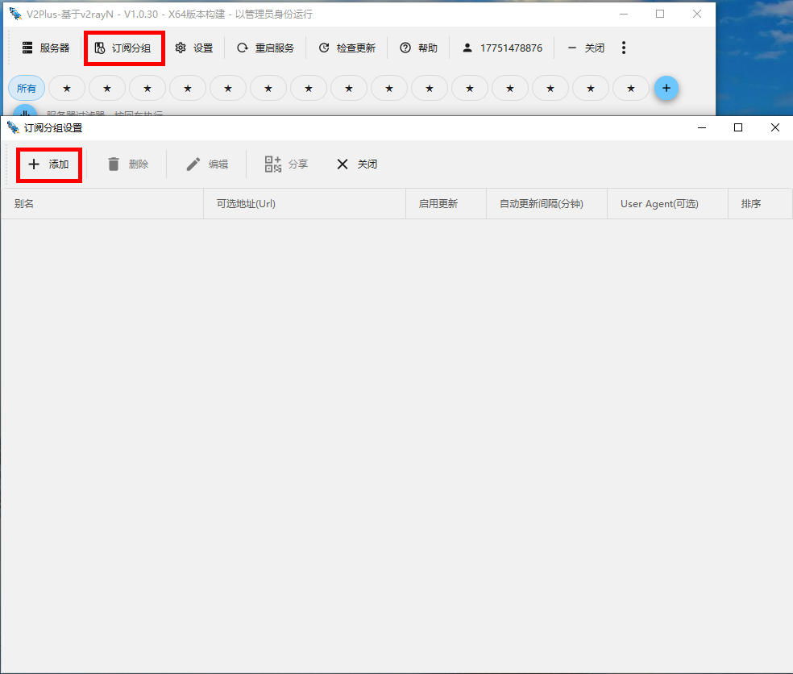
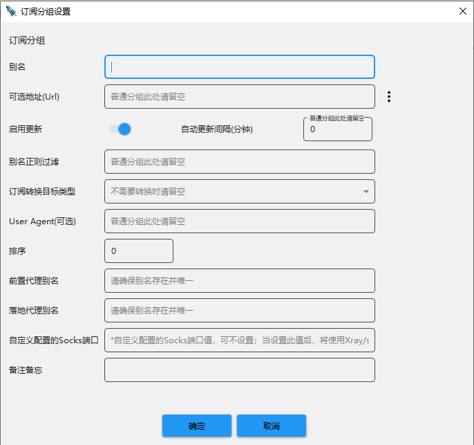

# v2plus怎么添加节点？

1. 打开v2plus：首先确保你已经安装并打开了v2plus客户端软件。

2. **点击左上角的”服务器”按钮**：在v2plus的主界面中，你会看到左上角有一个”服务器”按钮，点击它以打开服务器列表。

3. **点击”添加”按钮**：在主页面，选择订阅分组菜单，你会看到一个”添加”按钮，点击它以添加新的订阅节点。

4. **填写订阅信息**：在弹出的窗口中，你需要填写新订阅的相关信息，包括名称、订阅地址等。这些信息通常由提供服务的机场提供商或自行搭建的v2plus服务器提供。

5. **保存配置**：填写完信息后，点击”确定”或”保存”按钮以保存配置。

6. **返回主界面**：完成以上步骤后，你会发现新添加的服务器节点已经出现在服务器列表中。你可以返回到v2plus的主界面，然后选择你想要连接的服务器节点，点击连接按钮即可连接到该节点。