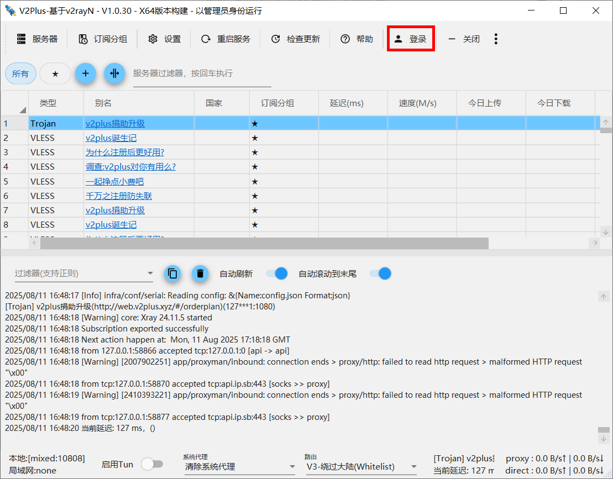
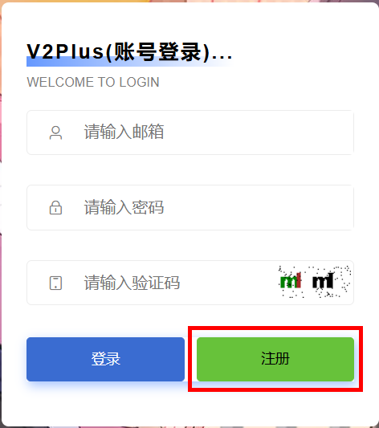
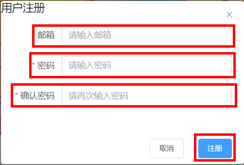
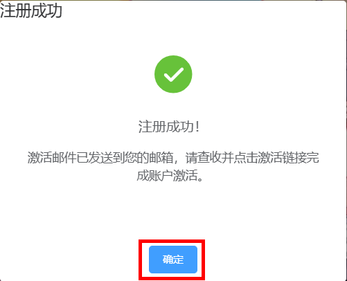
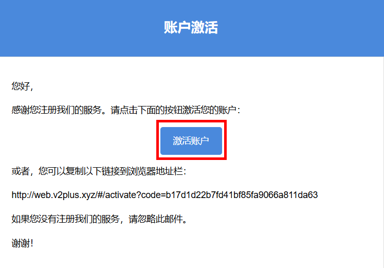
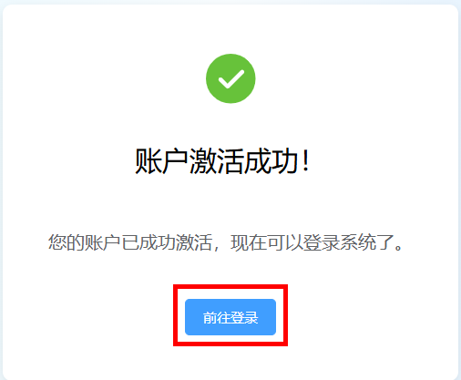
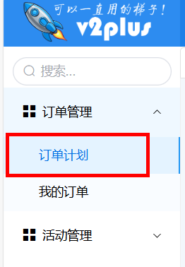
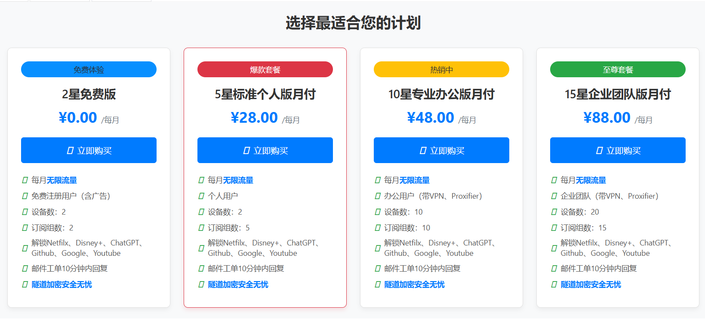
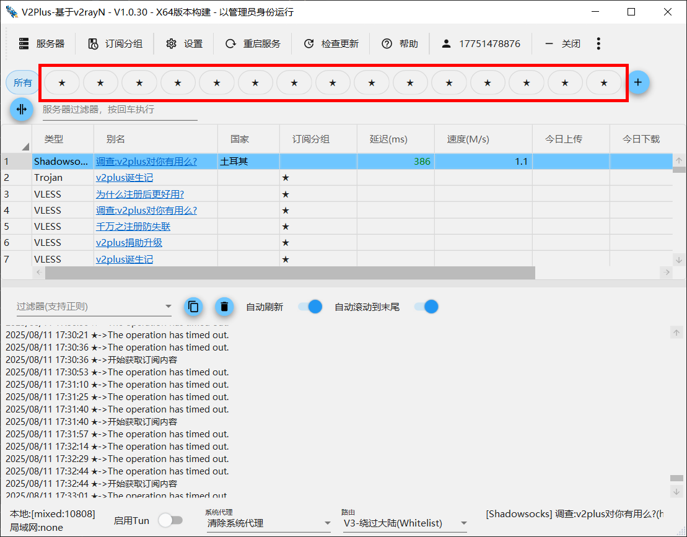

# 引言

在使用魔法工具V2Plus时，可能会遇到节点不够多，或者节点不够好用的问题。那你可以通过登录注册成为多星用户，来获得更多节点。

不仅如此，注册登录的好处还有以下三点：

1、注册后可以获得及时救援。当网络完全被阻断时，用户通过注册时留下的邮箱， 可以继续获得反馈的救援信息。

2、注册之后可以重新获得订阅列表，通过刷新系统，可以确保订阅列表的有效性和可用性 

3、注册之后，有更多的订阅列表可用。同时， 最大可用节点数也随之提高。

# 登录注册流程

1. 在主页面上点击登录。

2. 然后会跳到这个页面，没有账号就点击注册。

3. 输入邮箱密码，点击注册。

4. 注册成功后，会跳出这样一个界面，需要你去邮箱里点击链接进行激活。

5. 邮箱里的邮件长这样，点击它。

6. 在这个页面点击激活账户。

7. 跳出这样一个界面，就可以去登录了。

8. 登录后，在界面左上角找到订单计划。

9. 免费版只有两星，使用感差。你可以根据需求选择后面三个套餐，使得科学上网更流畅。

10. 购买完套餐后，界面上方就会变成这样，这样软件就非常好用了，解决了节点不够多的问题。

