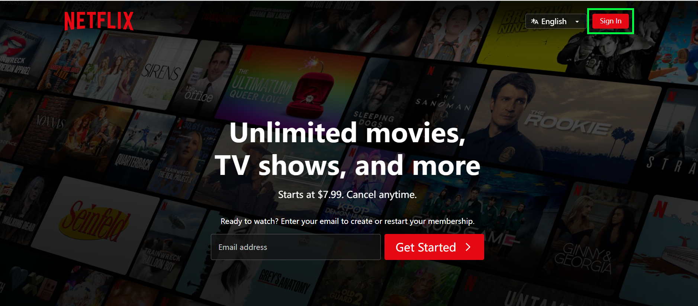
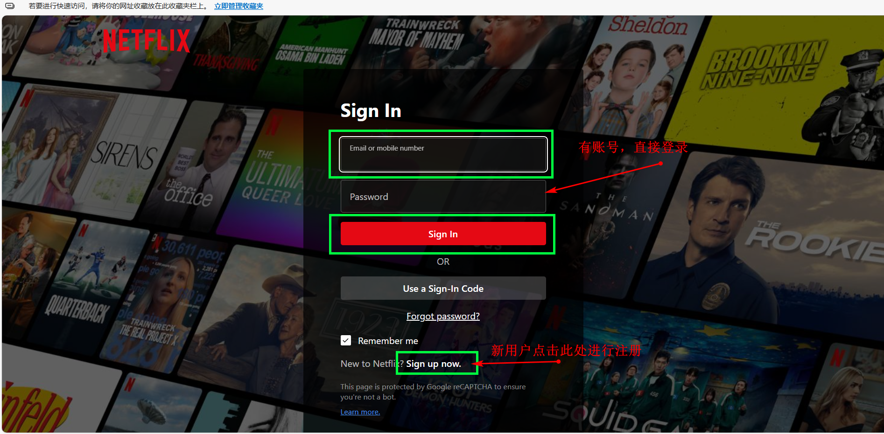
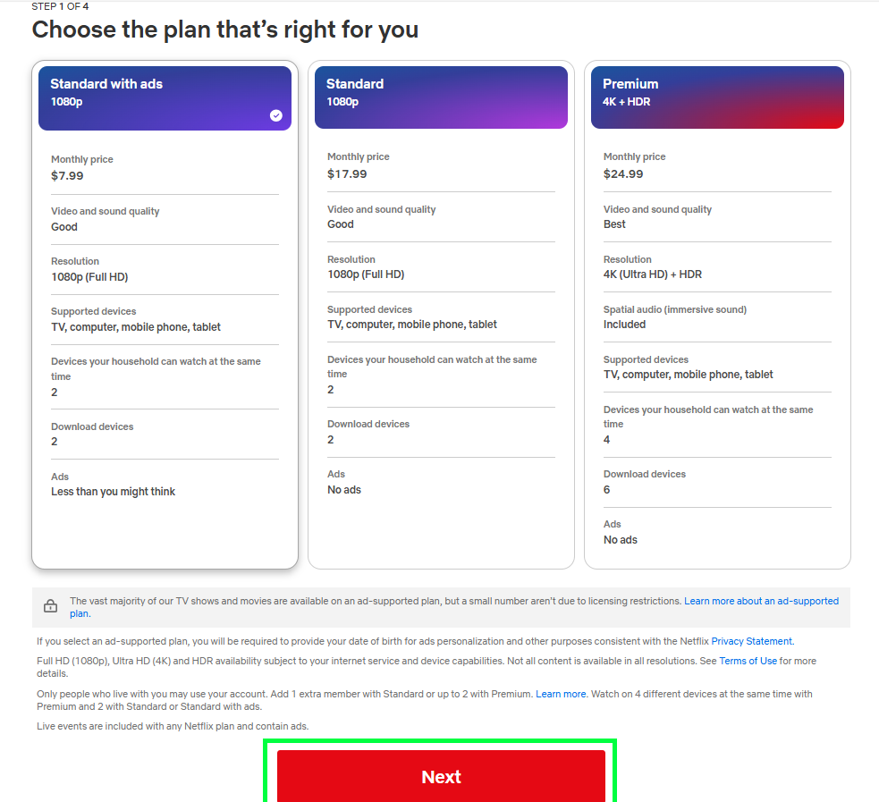
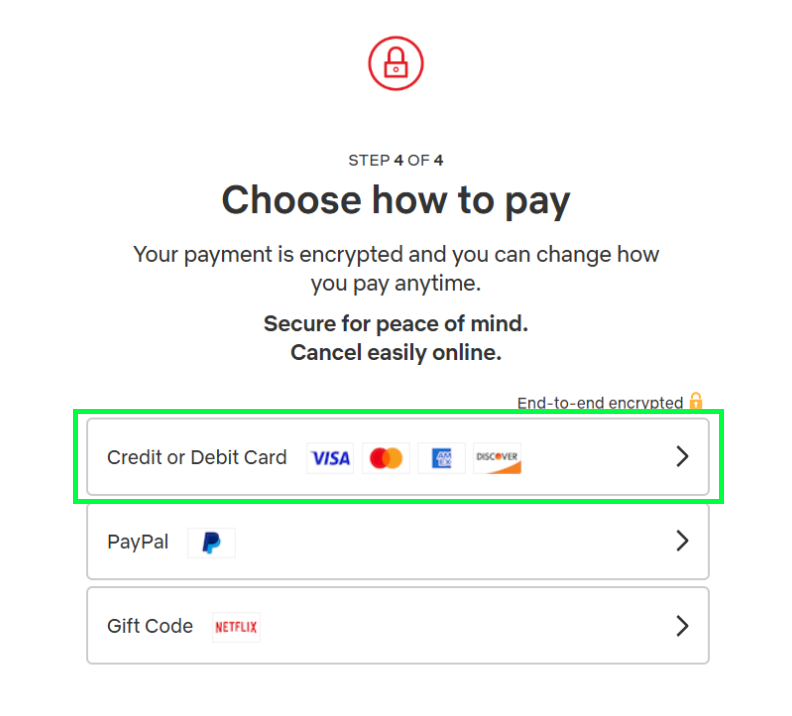
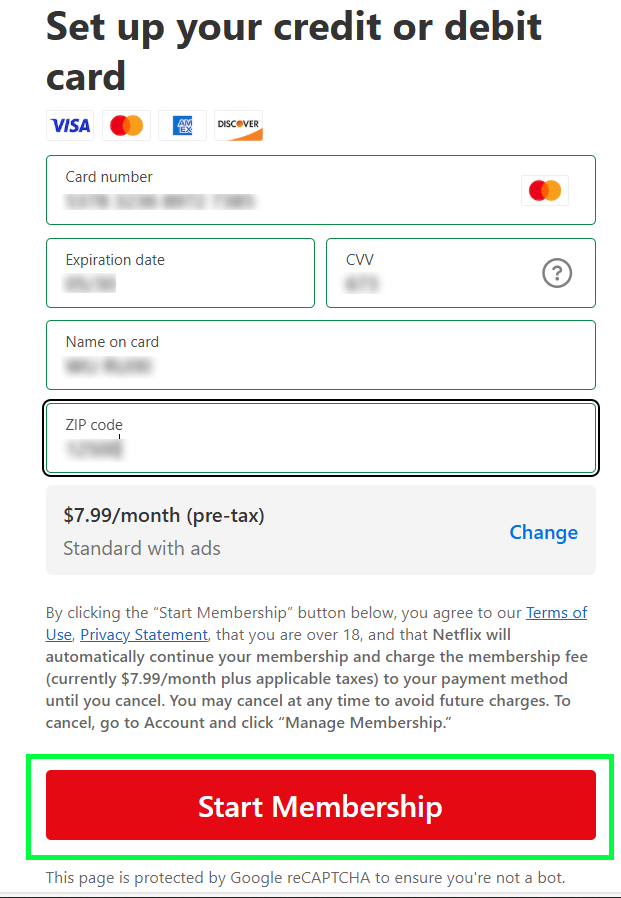
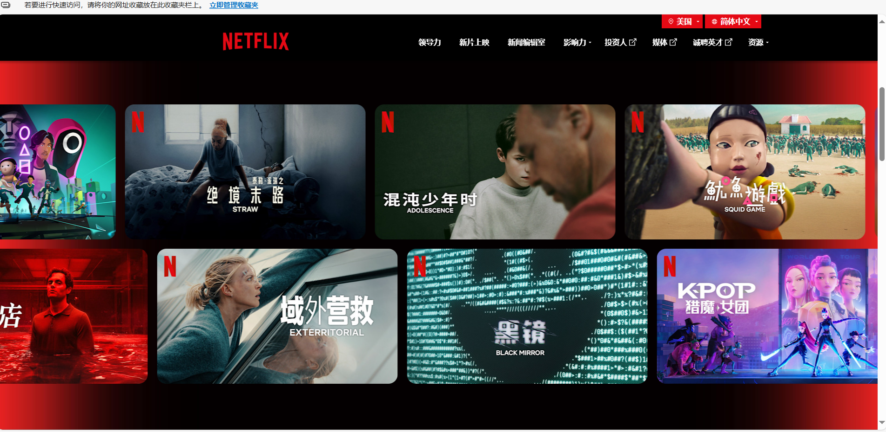

# 引言

你是不是一位美剧爱好者？！那你是不是遇到过这样一个令人头痛的问题...

 想打开Netflix，但根本无法下载....

那么下面这几步可以很好的解决这个问题，解锁全球Netflix资源。
# 1、下载及登录Netflix
### 方法一：在电脑上使用

1. 打开浏览器访问： https://www.netflix.com （如果打不开，可使用文章末尾的魔法工具！）Netflix的界面如下图所示，然后输入邮箱进行登录（推荐使用谷歌邮箱！）

2. 注册账户或直接登录

### 方法二：在安卓设备上下载

1. 连接科学上网，打开手机浏览器，访问 Netflix 官网： https://www.netflix.com
2. 网站底部会提示你下载Android版Netflix，或跳转到 Google Play,如果你可以访问 Google Play，直接下载安装即可。
3. 如果没有Play商店，可以搜索可靠渠道下载安装 Netflix APK，如 apkmirror、apkpure（需科学上网）。
### 方法三：在苹果设备（iPhone/iPad）上下载

1. 在科学上网连接状态下，打开“设置” → Apple ID → “媒体与购买项目” → 查看账户
2. 修改Apple ID所在地区为 美国/日本等Netflix支持地区
3. 保存后，打开App Store，搜索 **Netflix** 即可看到官方应用
4. 点击下载，安装完成后即可使用

   提示：建议准备一个用于海外App下载的Apple ID，避免影响你主用账户。
   
# **2、注册和订阅Netflix**

1. 进入Netflix官网，点击「注册」或「Start Your Free Trial」输入邮箱，设置密码。
2. 选择套餐（基础、标准、高级）

3. 填写付款方式（需使用可支付国际服务的卡，如双币信用卡、Visa/Master 借记卡、虚拟卡等）,我这里选择第一个支付方式。

输入相关信息，进行支付。

4. 完成后即可登录账户，开始使用Netflix服务！

  小技巧：你可以用外区的App Store充值卡/礼品卡订阅Netflix，绕开信用卡限制。
# **3、开启畅看模式**

1. 登录Netflix后，系统会根据你当前IP地址（即VPN节点）展示对应国家的片库内容  。
   例如：美国节点 = 美区Netflix，内容最多最全。
2. 记得确保科学上网工具始终运行，才能顺利访问Netflix及其内容（科学上网工具将在下点介绍）。
3. Netflix支持中英字幕、原声/配音选择，适合练习听力或沉浸式追剧。

# **4、上网问题**

科学上网是支持我们使用Netflix的关键，那么在这里可以提供一个魔法工具——V2Plus。

2. 确保你选择的节点能解锁Netflix（通常美国、日本、英国、加拿大等国家的节点效果最好）。
3. 优先选支持Netflix 4K/HDR播放的服务商。

这样就可以丝滑使用Netflix看你想看的了！是不是很妙~