# 引言

steam无与伦比的游戏库规模和多样性饱受游戏爱好者的青睐，它拥有最庞大、最丰富的游戏库。 频繁且大幅度的折扣让玩家能以实惠价格获取游戏。

你是否困扰于无法注册登录呢？

下面将介绍如何下载注册账号。

# 1、下载及注册Steam

1. 在浏览器中搜索Steam官网，进入后，点击左上角的下载。（如果进不去官网，可以使用V2plus工具，就在文章末尾。）

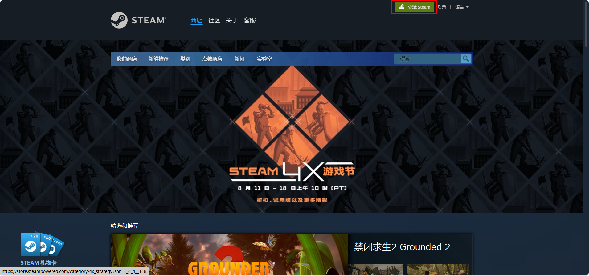

2. 跳到这个页面，然后点击安装STEAM。

3. 双击exe.文件，进行安装。

4. 选择合适路径（要确保路径文件夹中是空的，否则不行）。

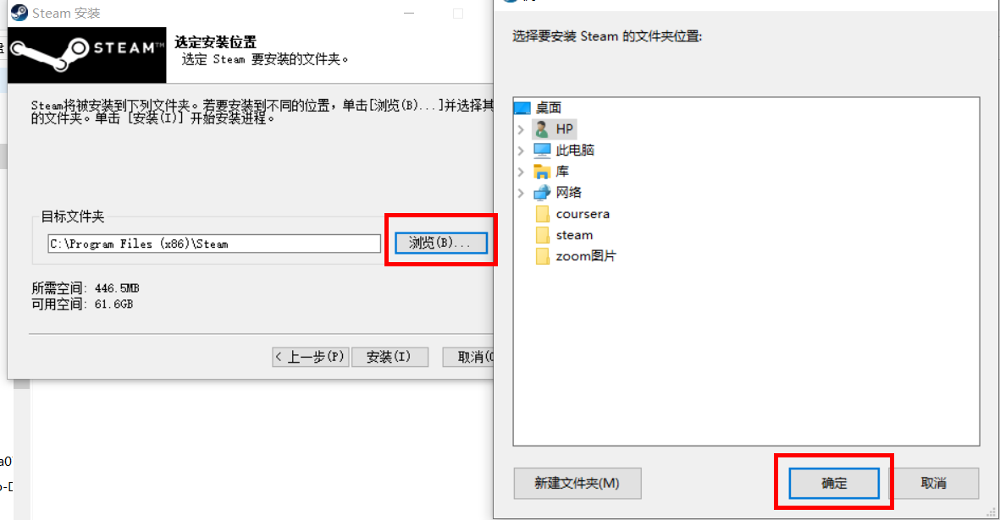

5. 选择需要的语言，点击下一步。

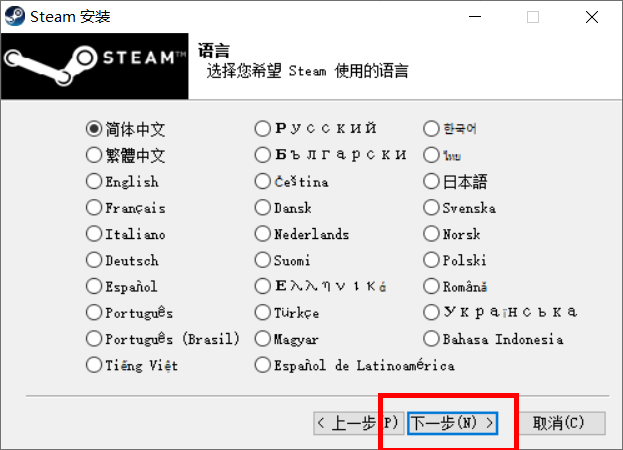

6. 点击完成。

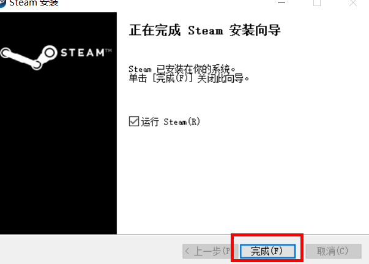

7. 然后会跳出这个检查进程。

8. 跳出登录注册界面，这里以注册一个账号为例进行介绍，点击创建免费账户。

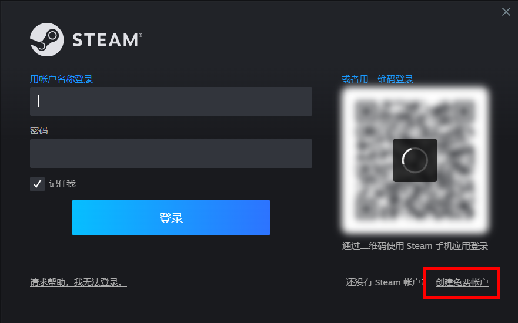

9. 输入邮箱，（经过测验，网易邮箱和QQ邮箱都可以，而google到下一步验证时，会显示不成功）点击继续。

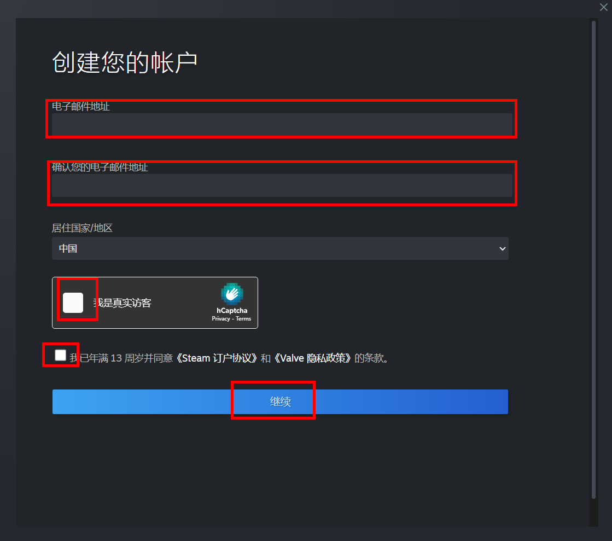

10. 跳出验证界面。

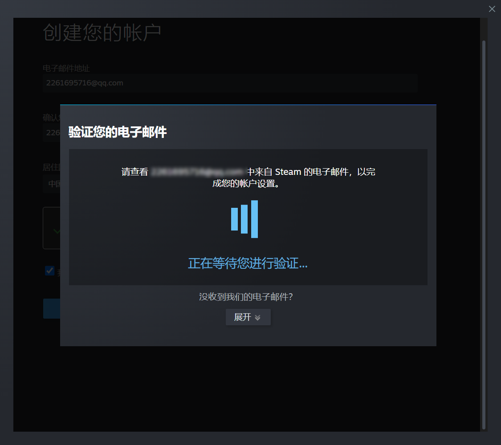

11. 登入你的邮箱，点击验证我的电子邮件地址。

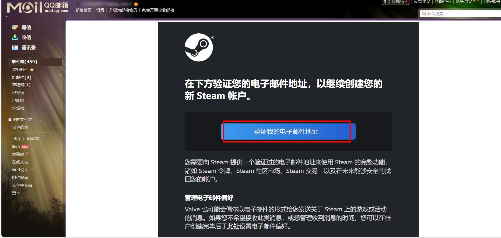

12. 显示验证成功界面，关闭该界面。

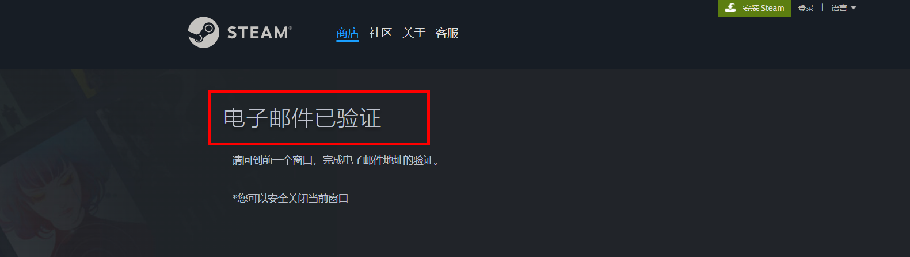

13. 在初始窗口创建Steam账号。

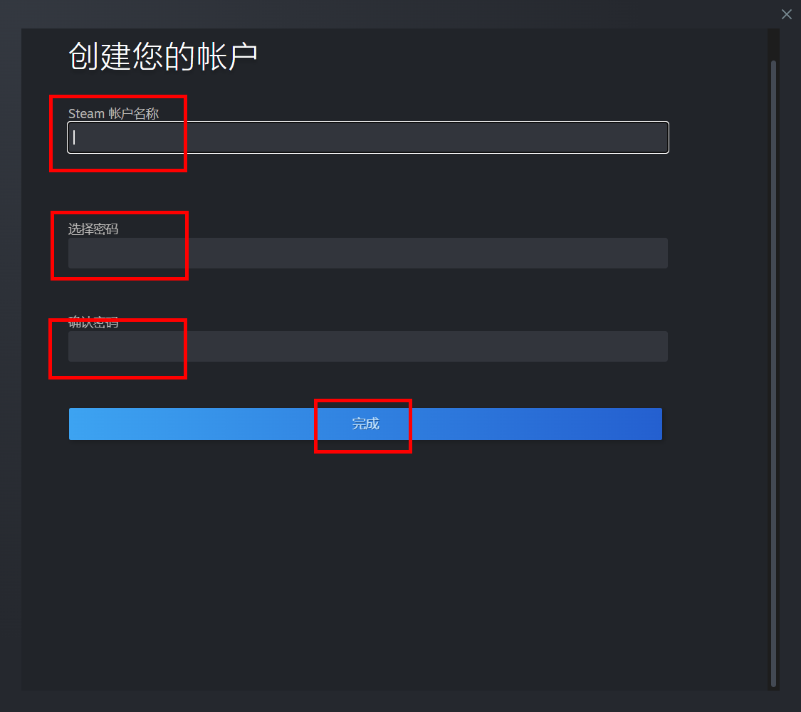

14. 创建完成后，登录，还需要一个邮箱验证。

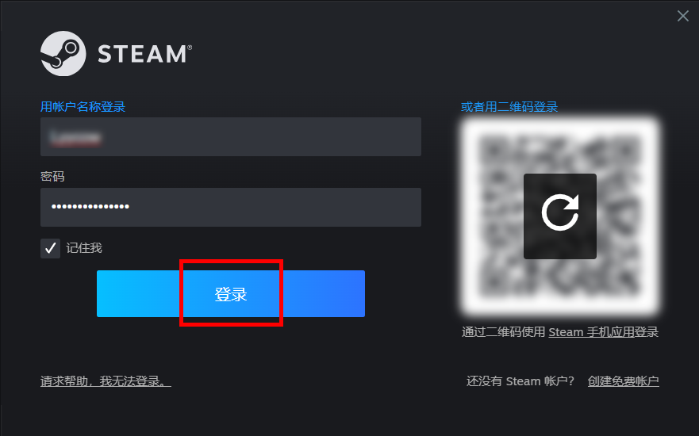

在邮箱中找到steam发的邮件，复制它给的代码。

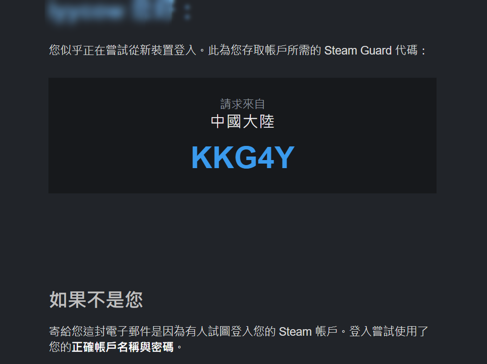

粘贴到这个框，就可以了。

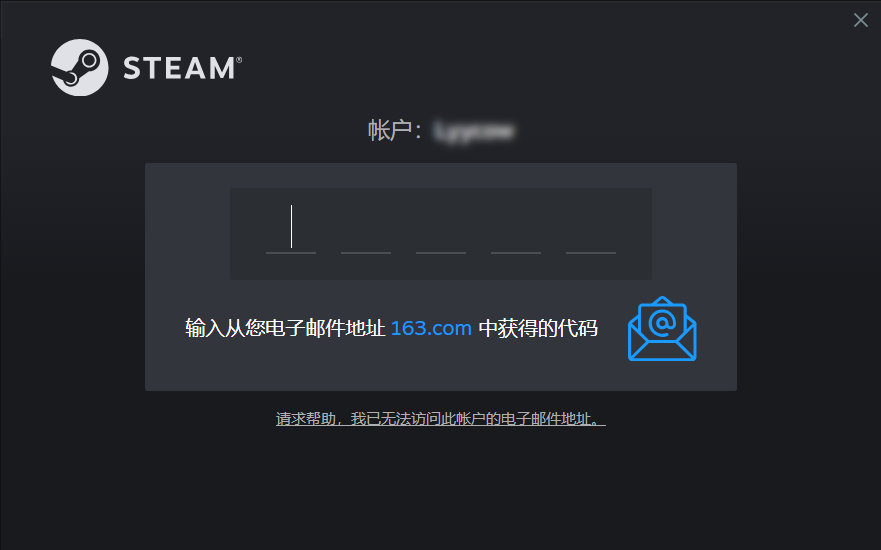

15. 然后就进入Steam了，可以在商店购买想玩的游戏，目前steam正在搞活动，比较划算。

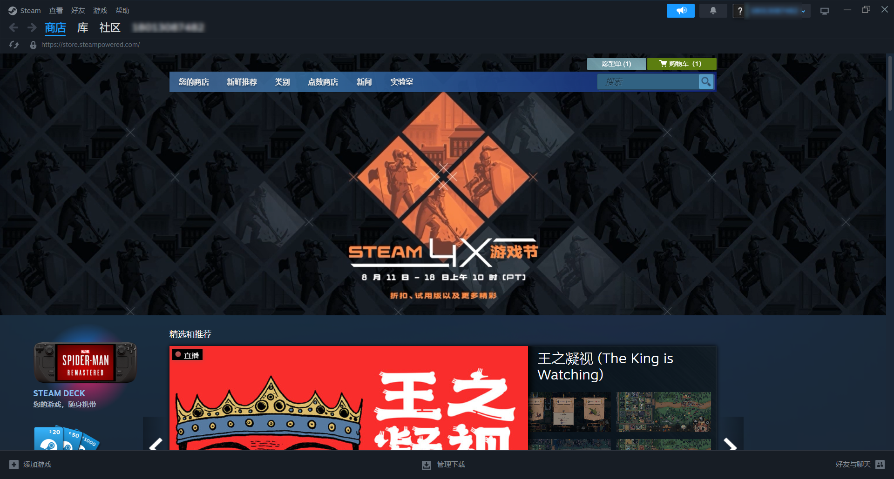

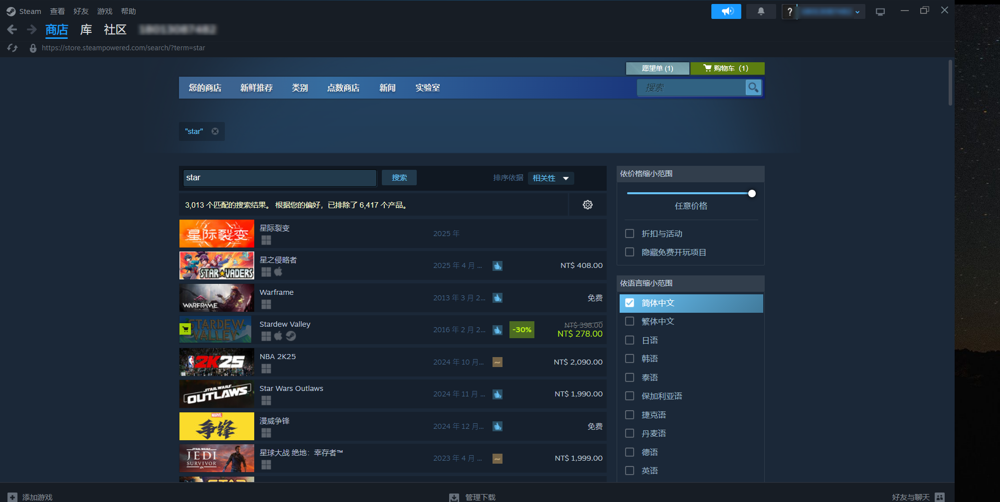

# 2、上网问题

如果没有v2plus，上述流程可能在第一部就终止无法进行下去了。
确保你选择的节点能解锁steam（通常美国、日本、英国、加拿大等国家的节点效果最好）。

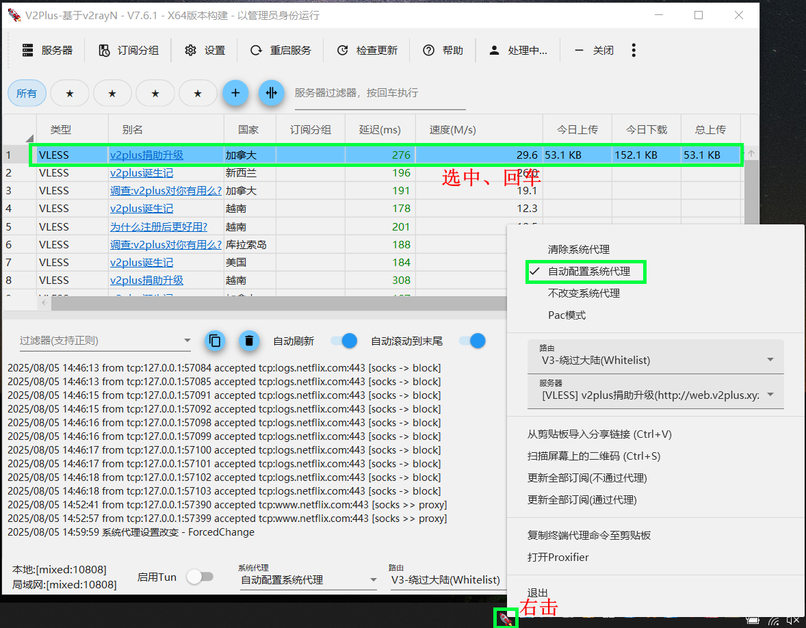
