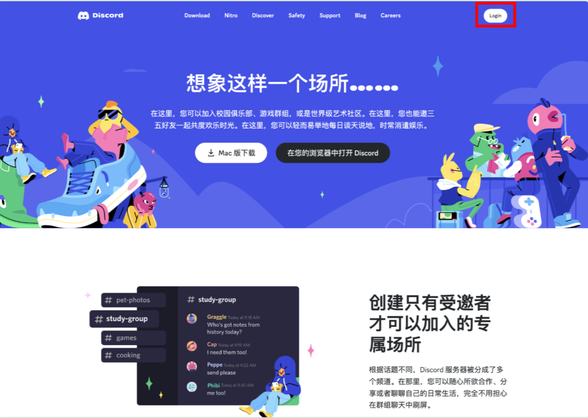
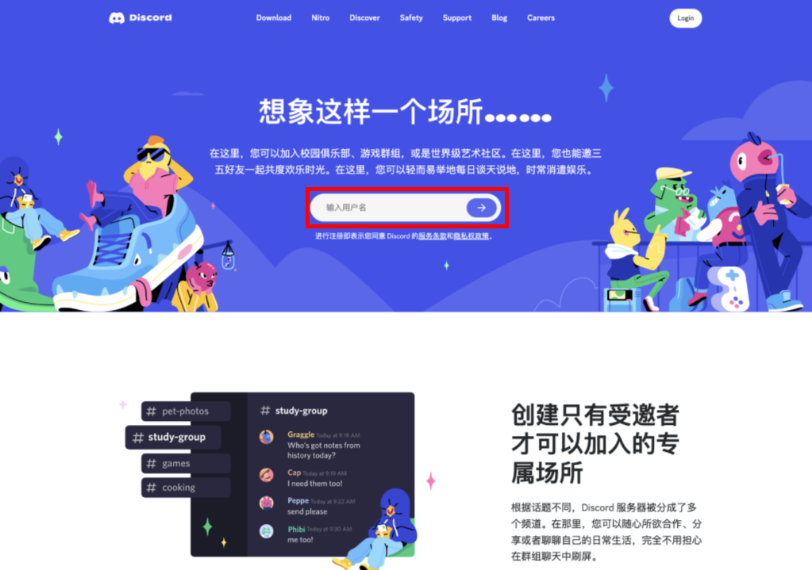
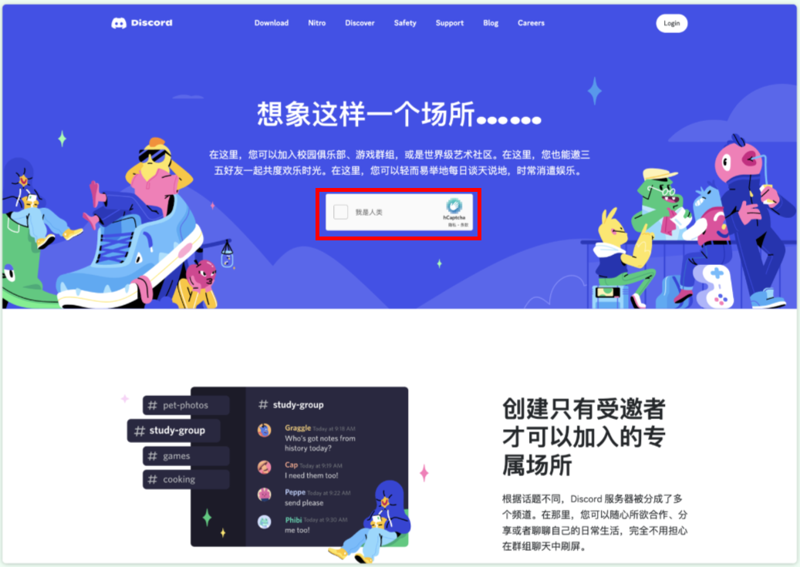
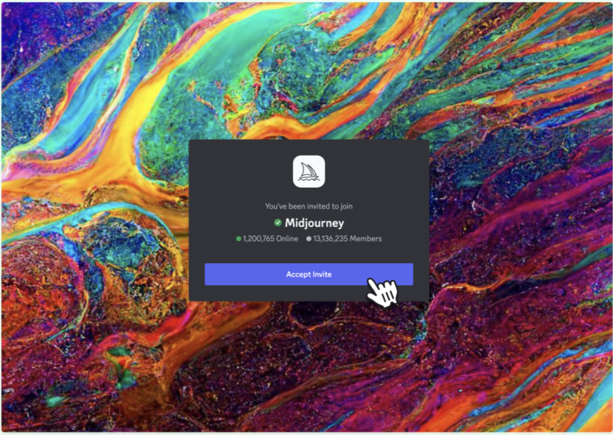
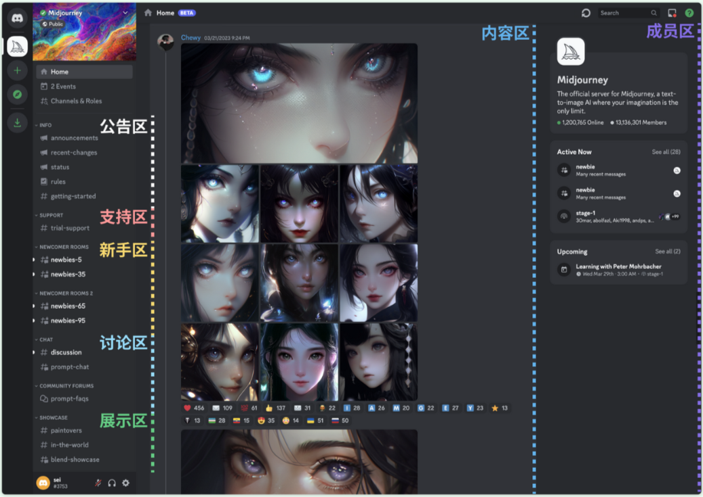
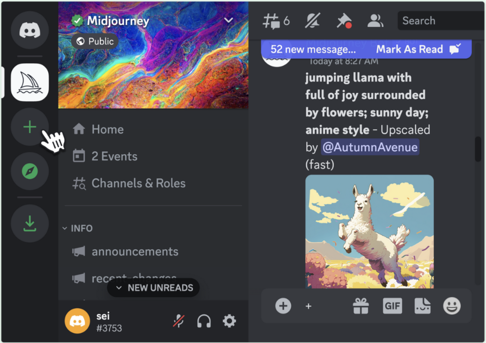
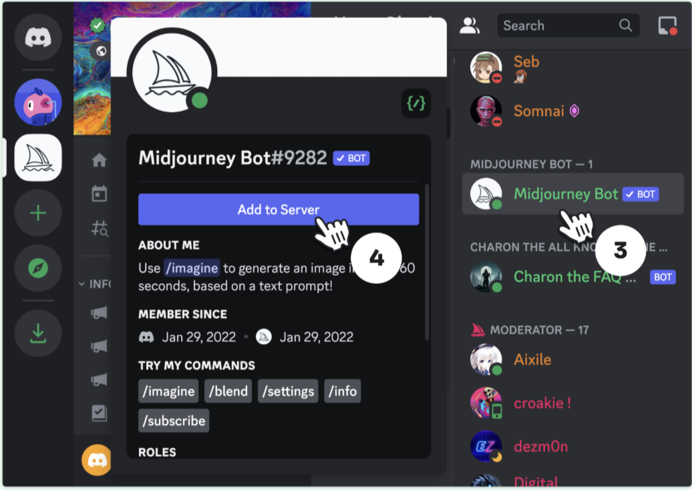
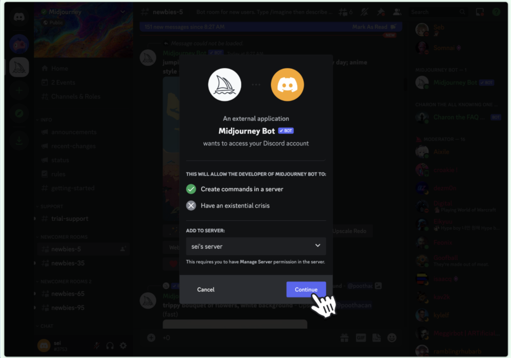
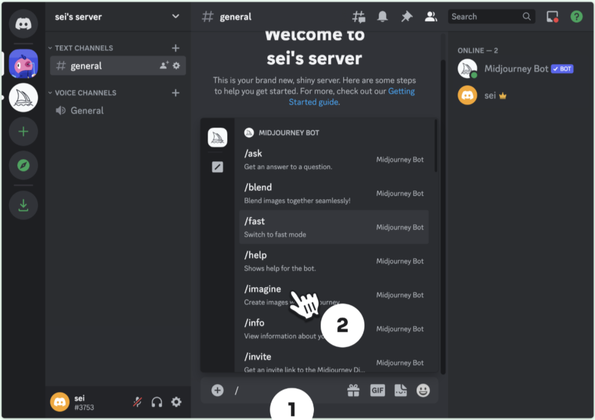

# 引言

做跨境电商，肯定要进行图文设计，那如何提高作图效率呢？我推荐Midjourney，它是AI绘图里实用性最强的。

# 1、注册Discord

首先，你需要注册一个Discord用来绑定Midjourney。

Discord 官网：[Discord - 专为游戏和快乐打造的群聊](https://discord.com/)

Discord 是一款面向海外用户、以实时语音交流为核心的虚拟社区平台，提供中文界面。使用该平台需配合魔法工具（可用文章末尾的V2plus），只要年满 18 岁并通过邮箱验证即可轻松注册。建议在注册前开启浏览器无痕模式，进入其官方网站按提示填写信息即可完成账号创建。

选择在浏览器中打开，并输入用户名。

# 2、验证Discord

注册后会要求进行机器人验证，点选验证即可。注意不要在登录过 Discord 的设备上再次注册新账号，大概率会触发手机验证，同一手机号不能绑定多个账号，不然会被系统判定账号异常从而锁定账户。

# 3、绑定Discord账号

Midjourney 官网：[Midjourney](https://www.midjourney.com/home)

点击 MJ 官网进入首页，在底部找到并点击「Join the Beta」按钮绑定 Discord 账号。

接受邀请。

进入 MJ 公共社区。

# 4、添加个人服务器

前面介绍 MJ 基本使用方式时讲过，若你嫌在公共社区创作太闹心，可以在 Discord 里添加自己的服务器，再邀请 MJ 机器人进来就行了，下面根据图示操作即可。

点击左侧栏的「+」按钮添加个人服务器。

点击左侧栏 MJ 服务器图标，进入后在顶部栏点击人员图标。

然后就可以在个人服务器作画了。

# 5、开始首图创作

输入 /imagine
在底部对话框中输入指令“/imagine”点击回车确认即可。

根据想要的图片输入提示词。

以上就是Midjourney全部教程了。
# 6、上网问题

科学上网是支持我们使用zoom的关键，那么在这里可以提供一个魔法工具——V2Plus。
确保你选择的节点能解锁zoom（通常美国、日本、英国、加拿大等国家的节点效果最好）。