# 引言

在做外贸业务的过程中，需要和其他国家的人进行交流，而zoom支持多人会议，视频会议，使得双方可以0花费进行跨国交流，省时省力，是不可多得的软件，下面将介绍它的具体使用方法。

# 1、客户端下载：

https://zoom.us/download#client_4meeting

# 2、加入会议：

（1）打开软件，选择“加入会议”：

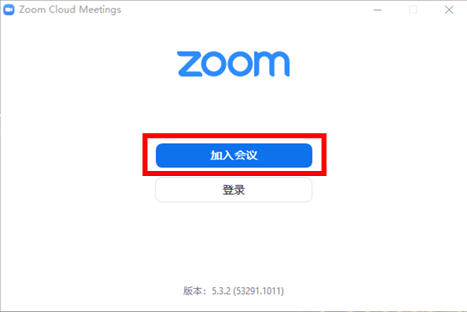

说明：
1、加入会议不需要注册或登录，有会议号和密码即可。
2、可以在会议开始前使用会议号和密码登录会议进行测试。
3、2020年5月20日后Zoom暂停中国境内新用户注册，只能加入会议。如需注册，可以使用文章末尾的魔法工具。

（2）输入会议链接或会议号，并设置本人姓名，建议设置为“学校英文名称+本人英 文姓名”的格式，例如“CSU Zhang San”

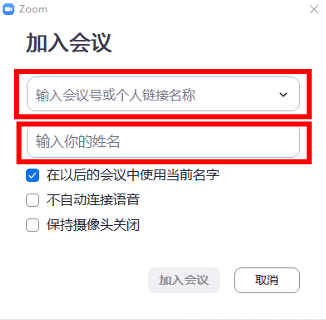

（3）输入会议密码，验证后即可进入会议：

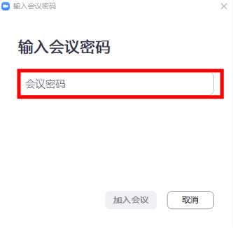

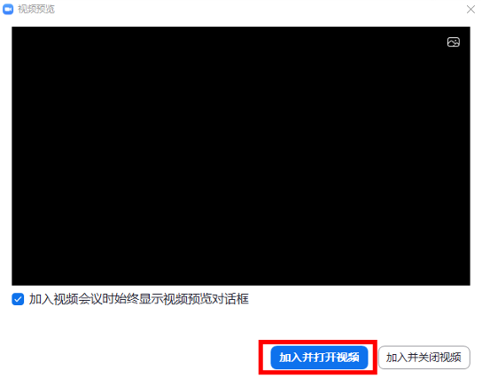
选择“加入并打开视频”

（4）选择视频和音频接入

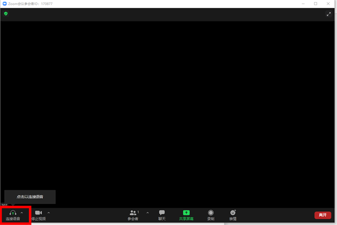

点击左下角“连接语音”即可设置音频设备，请在以下界面完成扬声器和麦克风设置，设置后进行检测，如无问题即可正常使用。

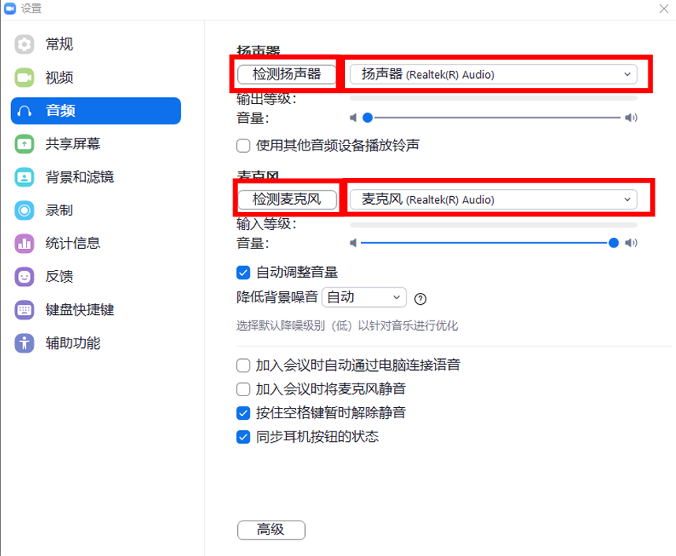

在“视频”选项中选择需要使用的摄像头。

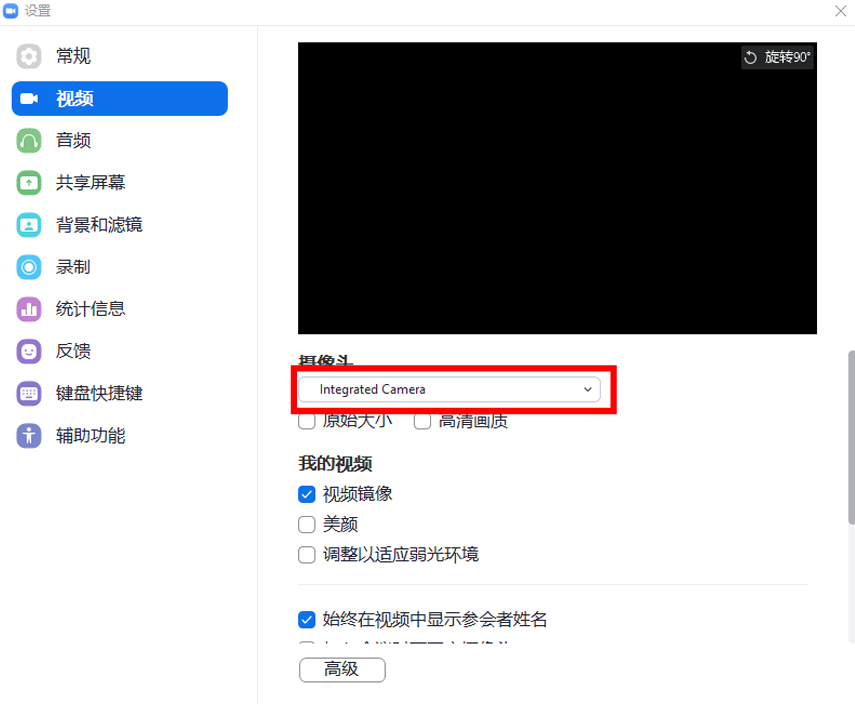

（5）以上为基本设置。如果需要进行特殊的设置，例如虚拟背景等，可以在“设 置”的对应选项中进行。

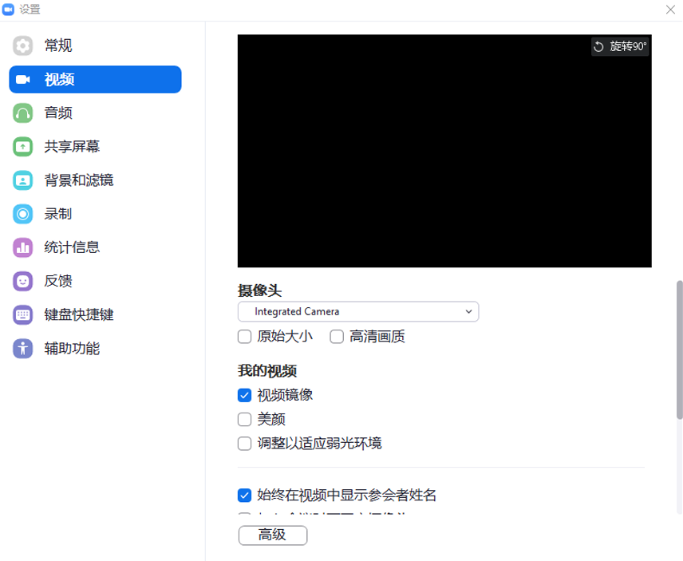

会议过程中，如果本人不发言，可以点击左下角“静音”，显示如下图时，则其他参会人员不能听到本人声音。如需发言，则可选择“解除静音”。部分设备可能会在会议开始时默认是静音状态，如发言时没有声音，请检查左下角是否是静音状态。

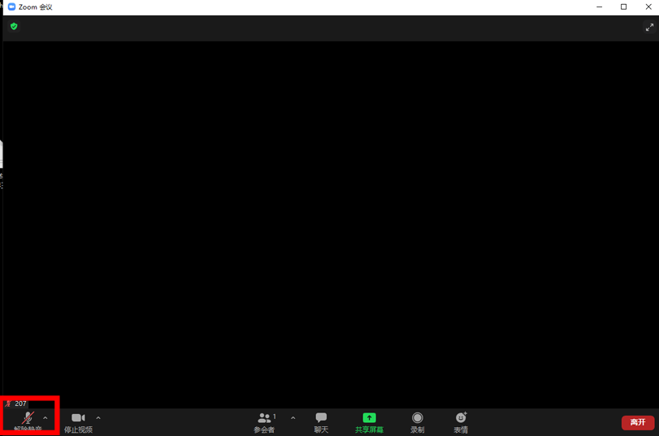

会议期间如需展示文件，例如PPT、word等，可以选择下方中间“共享屏幕”，点击后界面如下。“基本”支持本人目前屏幕上的文件和界面，建议打开本人需要使用的文件后并在此选项中操作。“文件”目前仅支持google drive和microsoft sharepoint，如果本人可以使用，也可以使用该选项。

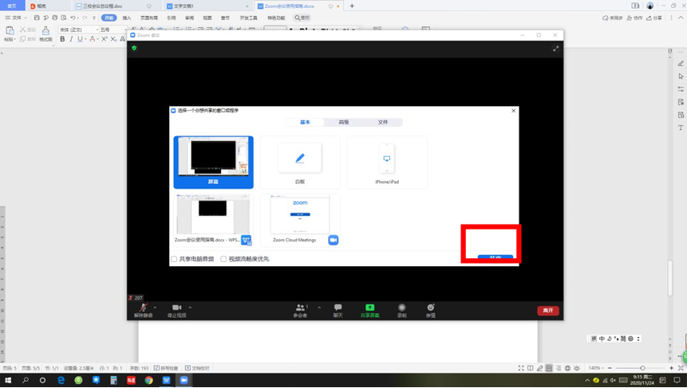

点击“共享”后即可显示以下界面，如需停止共享，可点击“停止共享”。

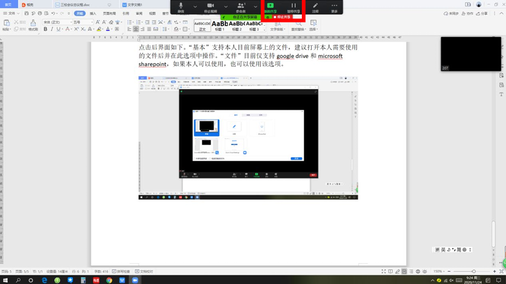

# 3、上网问题：

科学上网是支持我们使用zoom的关键，那么在这里可以提供一个魔法工具——V2Plus。

2. 确保你选择的节点能解锁Steam（通常美国、日本、英国、加拿大等国家的节点效果最好）。