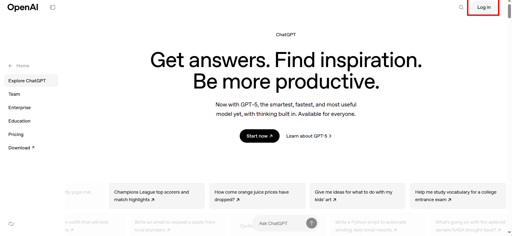
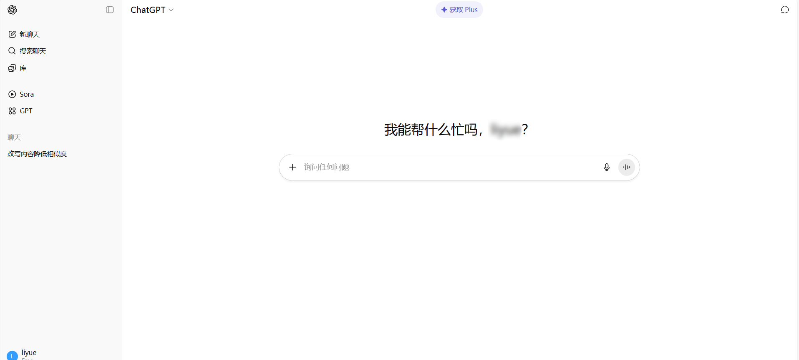
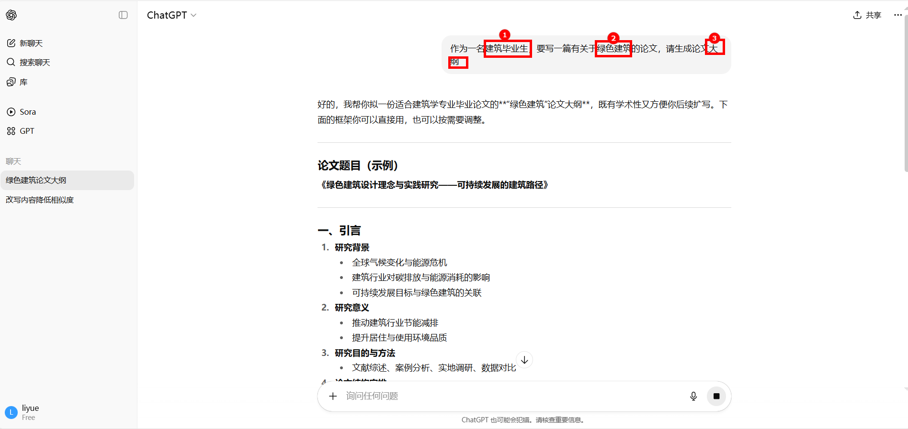
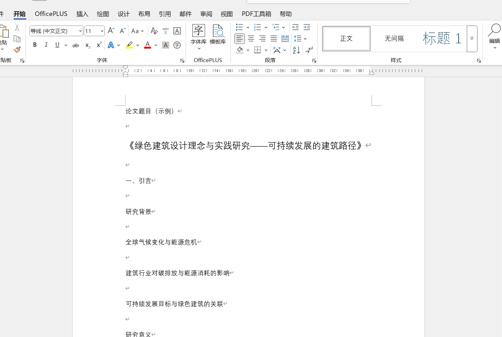
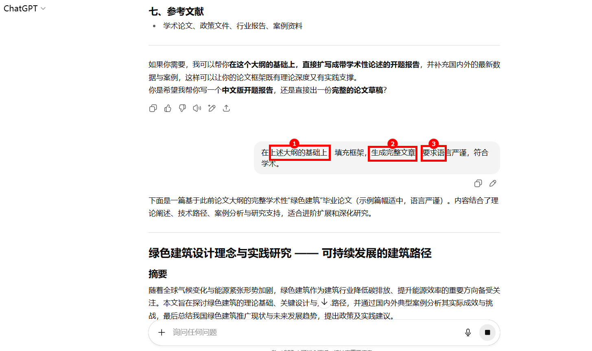
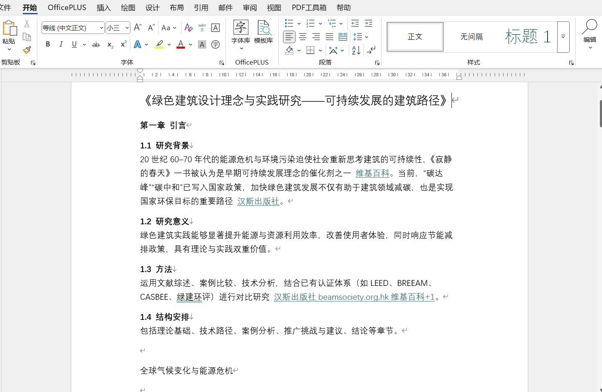
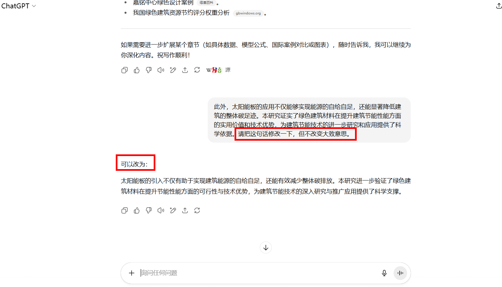
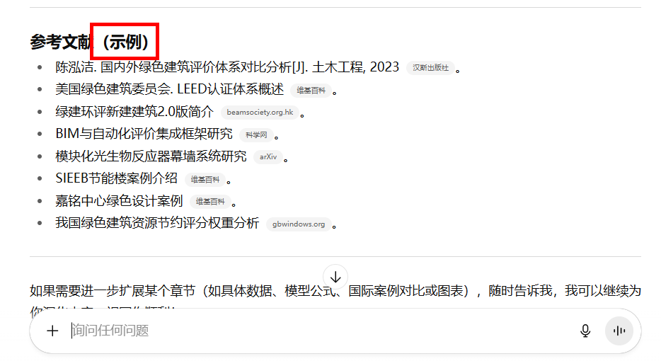

# 如何使用AI写出一篇高质量论文

几年来，AI发展迅猛，各行各业都有相应的AI。不得不说，AI给我们带来了太多便利，如果你是一位大学生，可以使用写作类AI，撰写论文大框架。让自己的论文从0到1的过程大大简短，提高效率。下面我讲重点介绍Chatgpt在写学术论文方面的使用。

# 1、Chatgpt的注册：
官网：[ChatGPT | OpenAI](https://openai.com/chatgpt/overview/)

进入官网之后，点击登录/注册。

（Chatgpt首页）

登录后，页面即弹跳出对话框，可以在此处提要求，与其交流，获得想要的内容。

# 2、撰写论文框架：

在使用Chatgpt进行论文的撰写时，
1. 首先要明确身份，提示Chatgpt以什么口吻写。
2. 罗列出论文的关键词，关键内容。
3. 写出最后要得到的内容。（如图）

接着它就生成出大纲了，当然，任何AI都不是绝对正确且聪明的，因此，要仔细阅读它生成的内容，进行思考，在此基础上进行修改，使之合理。但不管怎么说，Ai都大大减少人工思考的时间。

接着，将生成的框架复制到word，在word中进行修改。

# 3、填充论文框架：

现在，你可以在上述框架的基础之上，让Chatgpt给你生成完整文章。注意，要明确是在上述大纲之上进行生成，并且可以说出需要的语言风格，写论文需要学术严谨，接着它就生成一篇完整的文章给你了。

复制完整文章到大纲word中对应位置。

# 4、修改引用语句：

写论文，查重率是评估论文的一个重要指标，但是往往我们需要大量引用别人文章中的内容，那么为确保查重率在一个合理的范围内，我们可以使用Chatgpt来帮助我们修改语句，将别人的话变成自己的。

示例：

# 5、参考文献的引用：

AI不是万能的，如果它生成了许多参考文献，请一定要注意辨别真假，因为大多数参考文献都是AI杜撰的，如果不仔细检索，那将会造成比较严重的后果，尤其是当这篇论文比较正式时。
如下图，他生成的仅仅是示例！！这些文章全为假！

# 6、上网问题：

在整个注册登录流程中，必须要用到魔法工具v2plus。

它长这样

然后选择合适节点，就可以登录上面的网站。