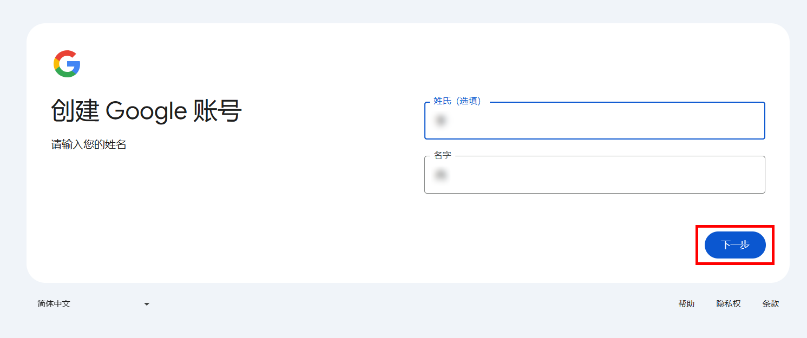
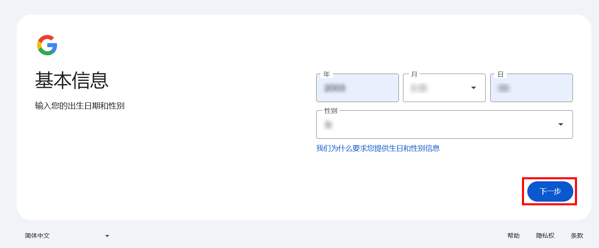
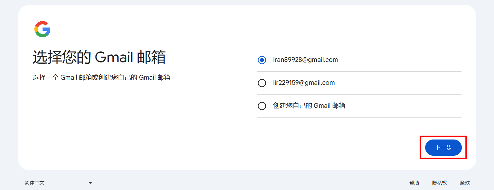
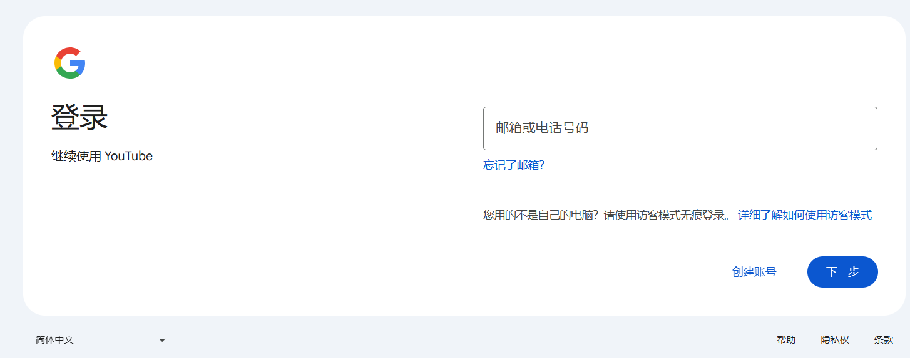
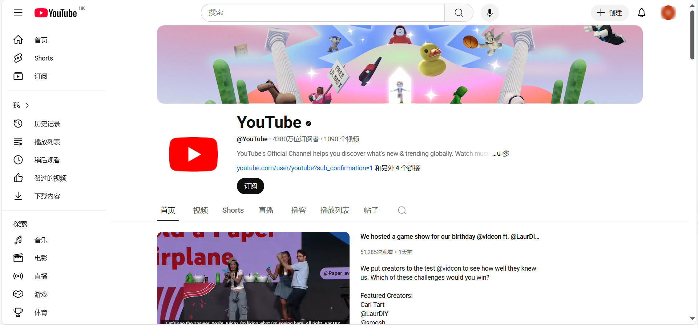

# 引言

YouTuBe是一个拥有海量视频资源网站，你可以在上面学任何想学的东西，看各种有趣视频。但大部分人还是把油管作为一个学习工具，毕竟上面有很多优秀的学习视频发布者。

下文只介绍pc端如何使用，首先你要有一个谷歌邮箱，谷歌邮箱是目前全球使用人数最多的邮箱之一，支持强大的反垃圾功能、15GB免费存储空间、跨设备同步等优点。

# 1、Gmail注册流程：

1. 打开注册页面

进入谷歌邮箱注册页面：[登录 继续使用 Gmail](https://accounts.google.com/v3/signin/identifier?continue=https%3A%2F%2Fmail.google.com%2Fmail%2Fu%2F0%2F&dsh=S-888754099%3A1755151659700010&emr=1&flowEntry=ServiceLogin&flowName=GlifWebSignIn&followup=https%3A%2F%2Fmail.google.com%2Fmail%2Fu%2F0%2F&ifkv=AdBytiPDhHJ1ePf7LT3KI9OHmhqLIGzMc4dOjkJht7F_qBhbi4LJjihWL-O33N0kNvMOwOe4ah__oQ&osid=1&service=mail)（可复制此网址到浏览器打开），如果打不开，可以使用V2plus工具。

2. 输入相关信息，不一定要填真实的。

3.接着会给你生成邮箱，也可以自定义。 

输入接收验证码的手机号，地区选中国。如果这一步提示号码不可验证，请尝试将网页语言设置为English（美国），或者将地区选为美国。

![[image.png]]

# 2、YouTuBe注册使用：

注册成功后，就可以使用这个账号来登录YouTuBe。
然后搜索YouTuBe，（Youtube没有电脑版的，所以只能通过网站进行使用。）进入官网，点击登录，即可享受海量视频资源。

登录后的页面如下所示。

# 3、上网问题：

在整个注册登录流程中，必须要用到魔法工具v2plus。

它长这样

然后选择合适节点，就可以登录上面的网站。