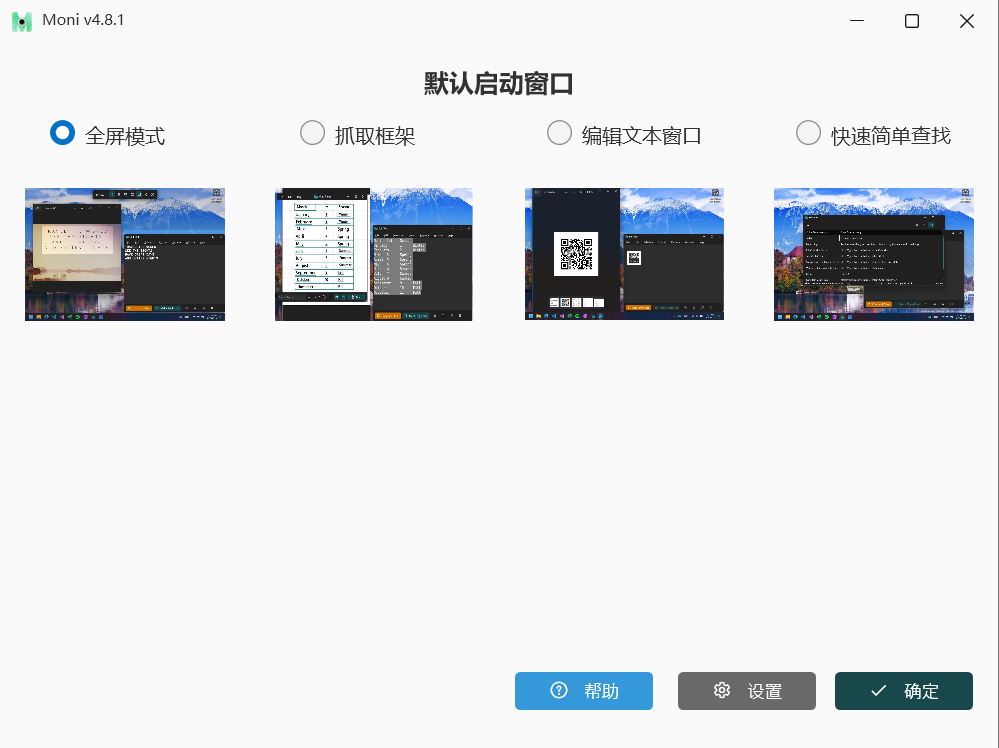
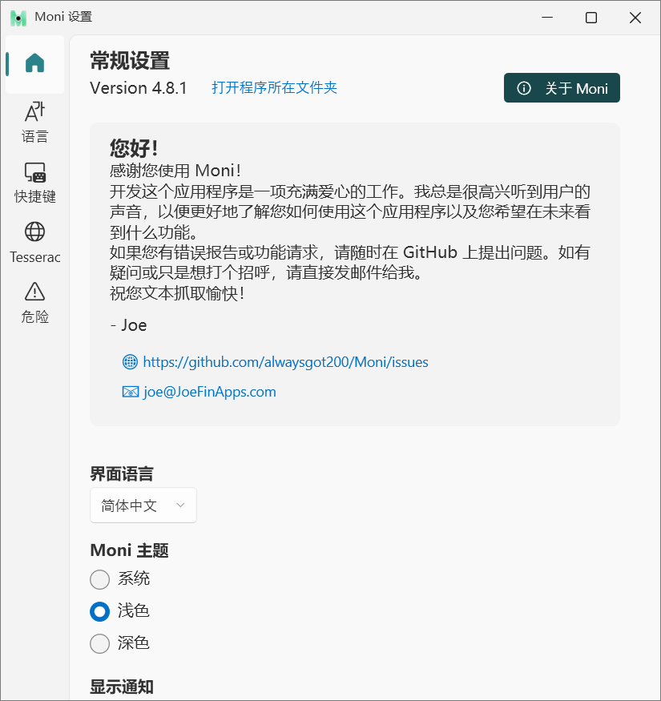
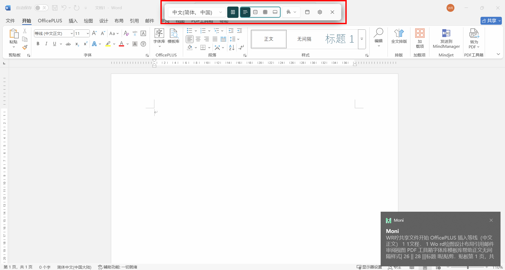
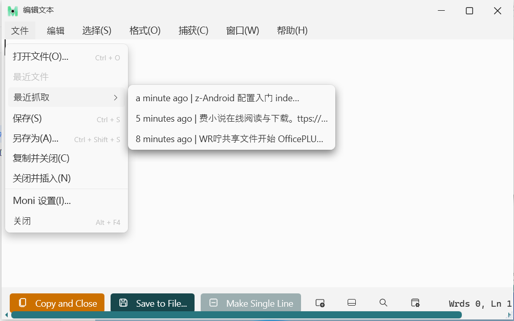
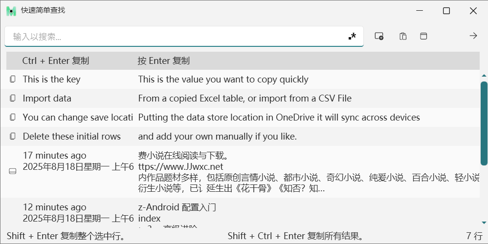

# 引言

你所用的文本抓取软件是不是读取文字不够精准？不能自动获得你想要的信息？选择模式不够多？那我接下来将为你介绍一款非常好用的软件——Moni。

## 1、登录下载

下载地址：
## 2、软件界面

下载完软件后，双击打开，软件会跳出首界面，如下图，首界面一共有四种功能模式可供选择。

设置界面，在这个界面你可以设置界面的主题色，切换语言，以及其他一些设置。

## 3、功能介绍

在首界面，点击想要使用的功能模式，下面详细介绍四种功能模式。
### 1.1  全屏模式--框选抓取文本

（1）点击主页面上的“尝试全屏抓取”，就会跳转到如图2所示界面，此时光标会变成十字，在想要复制的文字周围画一个矩形框。

（2）当屏幕上的文本被识别出来后，它会被放入您的 Windows 剪贴板中，此时会弹出消息通知。然后使用 Ctrl V 就可以粘贴文本。  
注意：如果没有结果，文本抓取功能会返回到选择模式，再次尝试。

### 1.2  抓取框架

抓取框”是一个可移动或调整大小的窗口。它会置于其他窗口之上，并会读取窗口边框内的所有文本。抓取框架模式，对于表格文本获取友好，

此模式具有直接在框选的文本上添加表格的功能。  
（1）文字边框两种使用方法  
方法一：点击或拖动以选择文字边框范围，点击“抓取”（Grab）会有消息通知窗弹出，点击通知就可以编辑并复制文本。  
注意：1.使用鼠标滚轮就可以放大或缩小边框范围  
          2.暂停抓取框并使用滚动以放大一段文本。

### 1.3   编辑窗口

与记事本的功能类似，文本编辑窗口提供的是“纯文本”编辑，没有格式设置。这意味着将文本复制到该窗口或从该窗口中删除时，会删除所有格式，

但换行符和制表符会保留。使用全屏抓取或抓取框架来收集文本，会有历史记录，在最近文件下拉框中就有抓取文本的历史记录，如下图所示。

### 1.4  快速简单查找

与全屏模式或抓取框架模式不同，快速简单查找模式并不使用 OCR 技术。输入搜索关键词相关文本，以便快速筛选结果。

按回车键即可复制查找值并迅速关闭窗口。

