# 帮您发发——专业的发码平台

## 1、终端用户使用说明

- 1、商品链接获取
- 
- 通过网页、社区、论坛等，浏览到相关内容， 并下载相应的压缩包  
例如：在CSDN浏览到你想要的内容，在此页面复制百度网盘链接并转存到百度网盘，在网盘下载相应的压缩包。 
注意：要先登录百度网盘才可以转存文件。

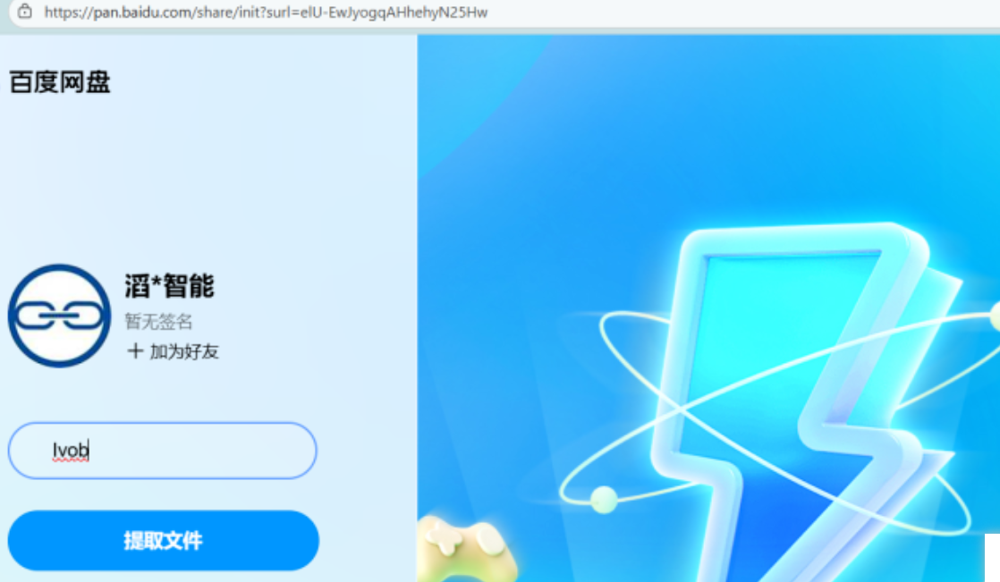

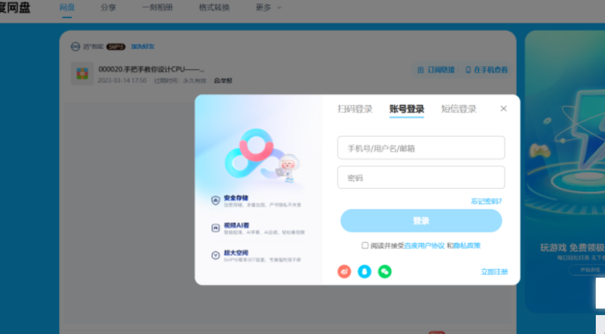

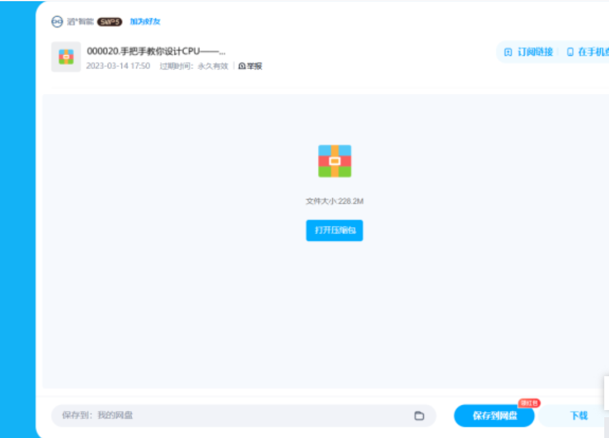

- 2、解压商品获取二维码

解压压缩包的第一层， 获得扫码URL， 或者二维码图片。

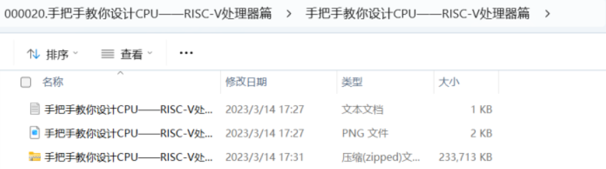

- 3、获得商品内容
扫码支付，（1）浏览网页，扫码，支付。（2）直接扫图片二维码、支付 最终获得：解压密码。

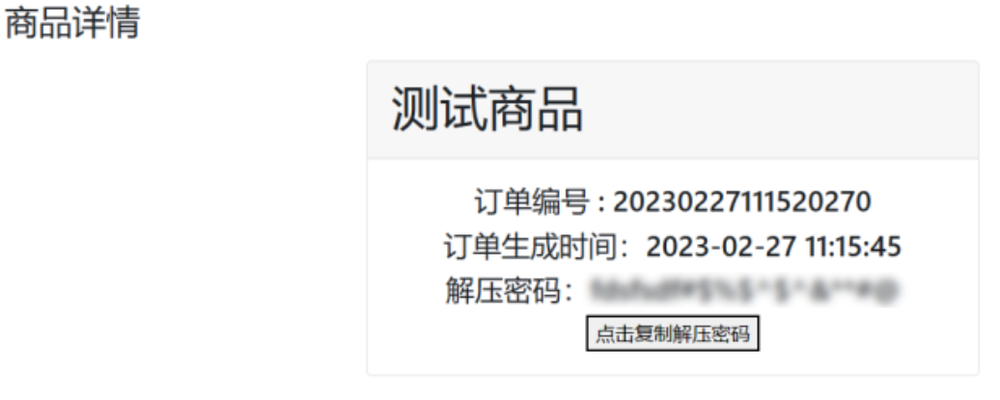
- 4、密码丢失等情况解决办法

若支付成功，获取密码失败、密码错误、得到密码但忘记等情况以至于无法获得商品内容，需要申诉，

登录帮您发发官网：[https://www.80fafa.com/](https://www.80fafa.com/ "https://www.80fafa.com/") ，点击查询订单入口。

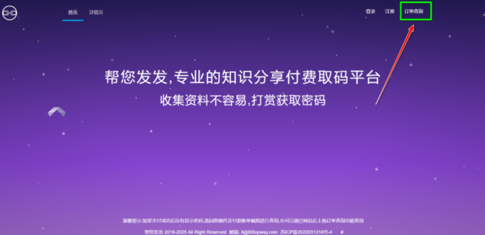
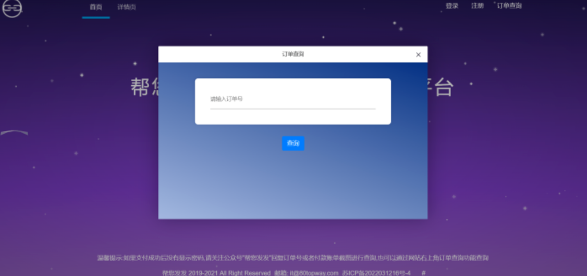
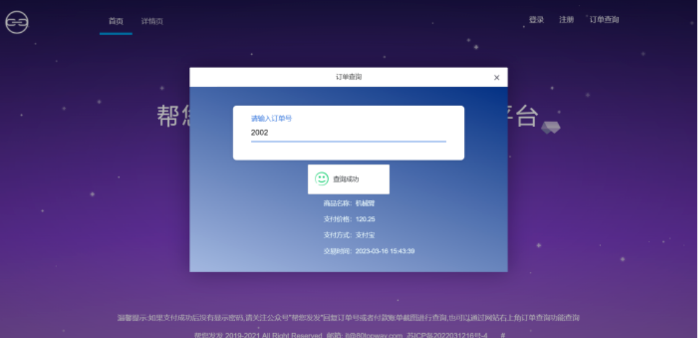

- 5、举报商品

注册登录帮您发发官网，在菜单栏中点击用户投诉，可在用户投诉填写相应内容、投诉说明、证明图片等。填写完成后点击保存提交。

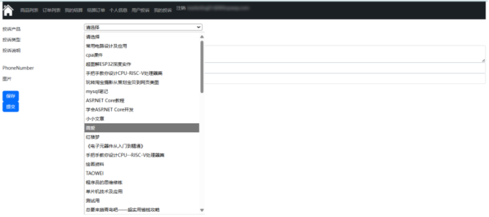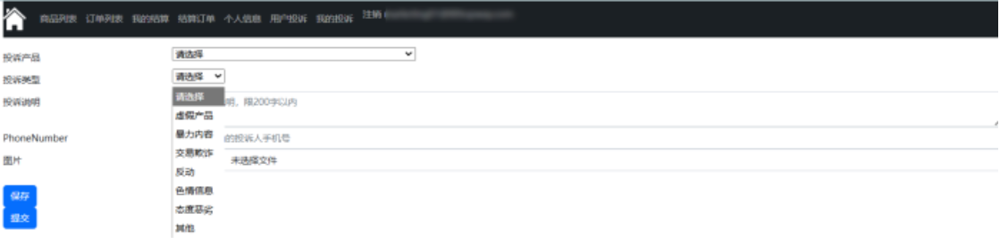

在我的投诉里面查看可以投诉记录

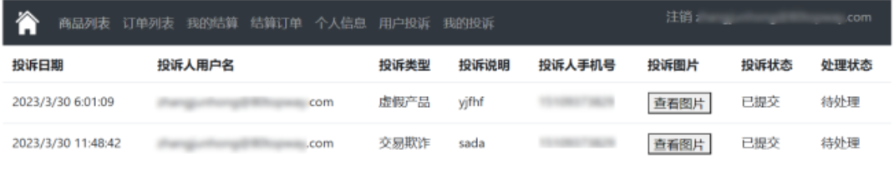

