# 好用的AI分享

现在越来越多的AI涌现出来，让人眼花缭乱，当面临选择的时候，往往就陷入：到底用哪个好的问题。

下面整理出了很好用的各种类型的AI工具，帮大家摆脱选择恐惧症。

这其中包含了：**AI 通用聊天、AI 搜索、AI 写作、AI 绘图、AI 视频、AI 编程**。

# 1、AI通用聊天

**Deepseek：**[DeepSeek | 深度求索](https://www.deepseek.com/)
2025年国产AI，非常引人注目，支持深度思考，但还没有生成图片的功能。

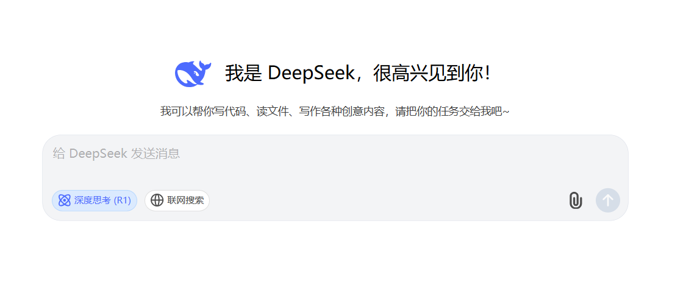

**ChatGPT：**[chatgpt.com/overview](https://chatgpt.com/overview)
可以画图、可以联网，可以做智能体，现在也能支持深度思考了。

**3、豆包**：[豆包 - 字节跳动旗下 AI 智能助手](https://www.doubao.com/chat/)
豆包是字节的产品，中文理解能力好，支持自己做智能体。

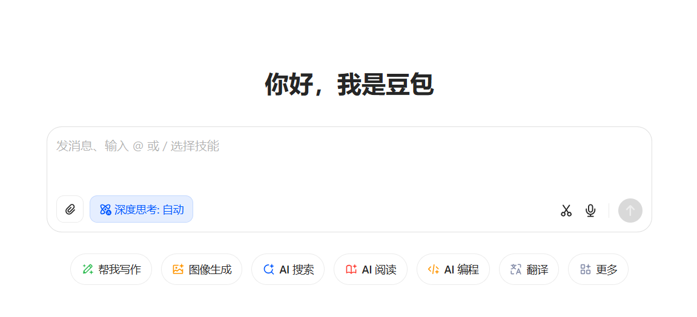

4、**Claude**：[App unavailable \ Anthropic](https://www.anthropic.com/app-unavailable-in-region)
海外的一款当年和 OpenAI 一绝高下的产品，在写作能力上表现优秀。

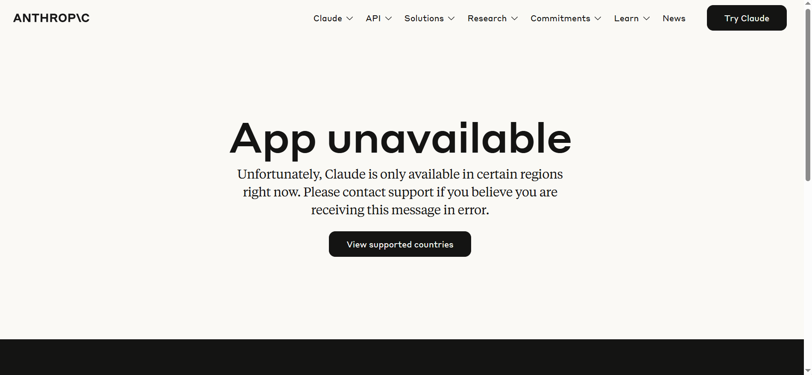

# 2、AI搜索

**1、秘塔AI搜索**：[秘塔AI搜索](https://metaso.cn/?from=ai-tab.cn)

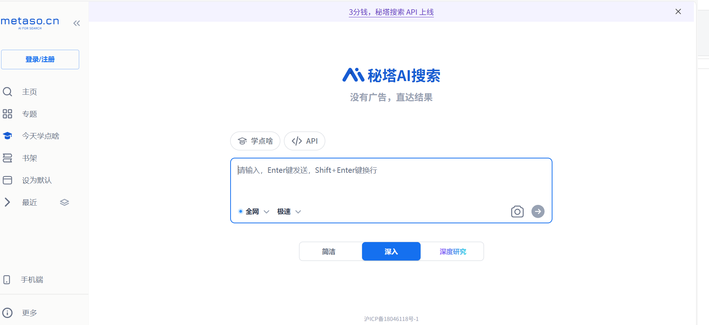

**2、Perplexity**：[Perplexity官网](https://perplexitycn.com/)

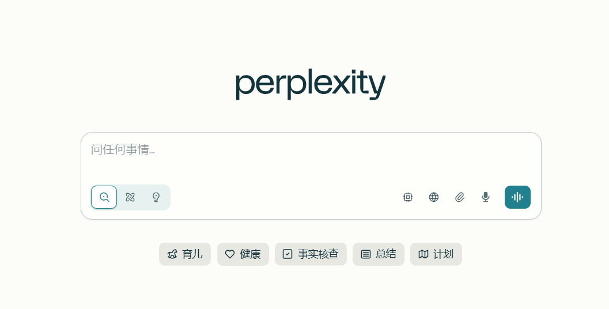

**3、纳米AI搜索**：[纳米AI - 首页](https://bot.n.cn/?src=xz_dh_logo)

# 3、AI写作

**1、NotionAI**：[Notion AI](https://www.notion.com/zh-cn/help/guides/category/ai)

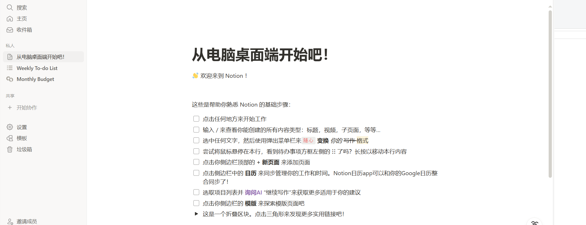

**2、语雀AI**：[工作台 · 语雀](https://www.yuque.com/dashboard)

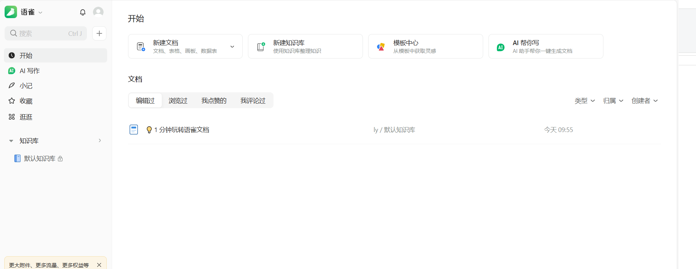

# 4、AI绘图

**1、Midjourney**：https://www.midjourney.com/

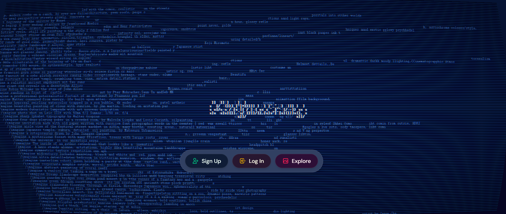

**2、即梦AI**：[即梦AI - 一站式AI创作平台](https://jimeng.jianying.com/ai-tool/home/)

**3、Stable Diffusion**：[Stable Diffusion官网](https://stabilitycn.com/)

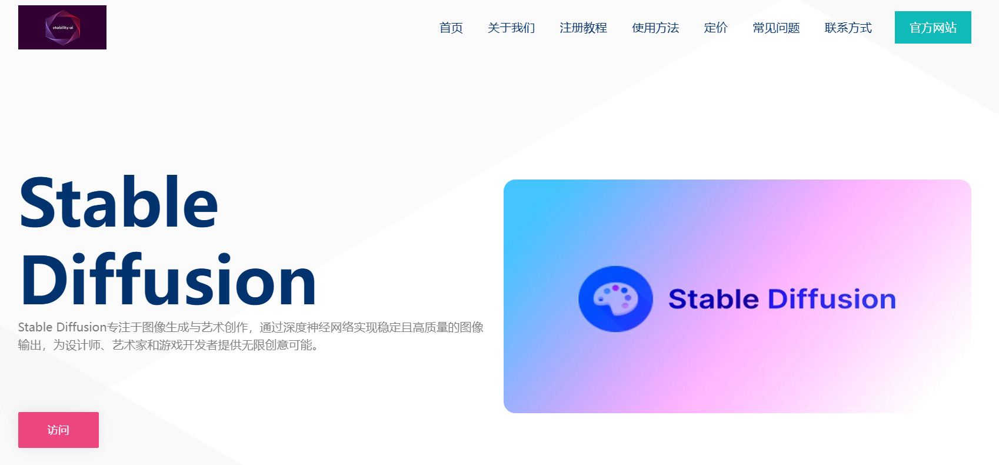

# 5、AI视频

**1、可灵**：[可灵 AI - 新一代 AI 创意生产力平台](https://klingai.com/cn/)

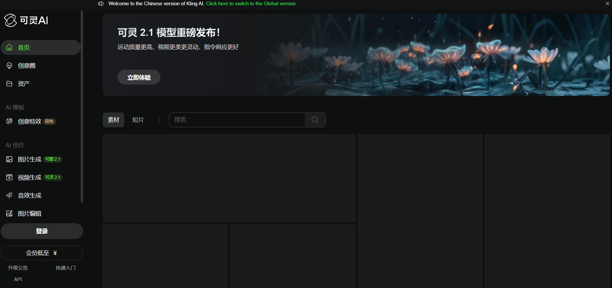

**2、智谱清影**

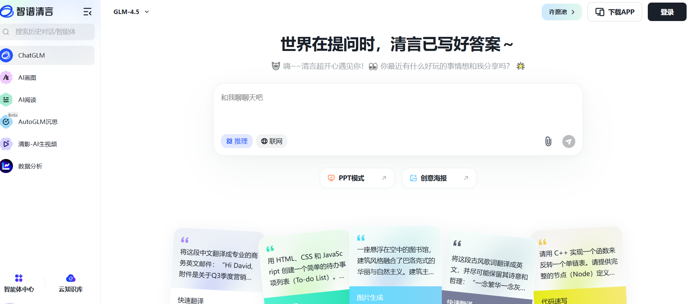

**3、vidu**

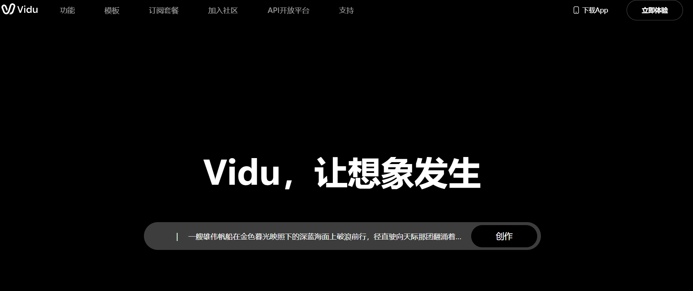
# 6、AI编程

**1、Trae**

**2、Cursor**

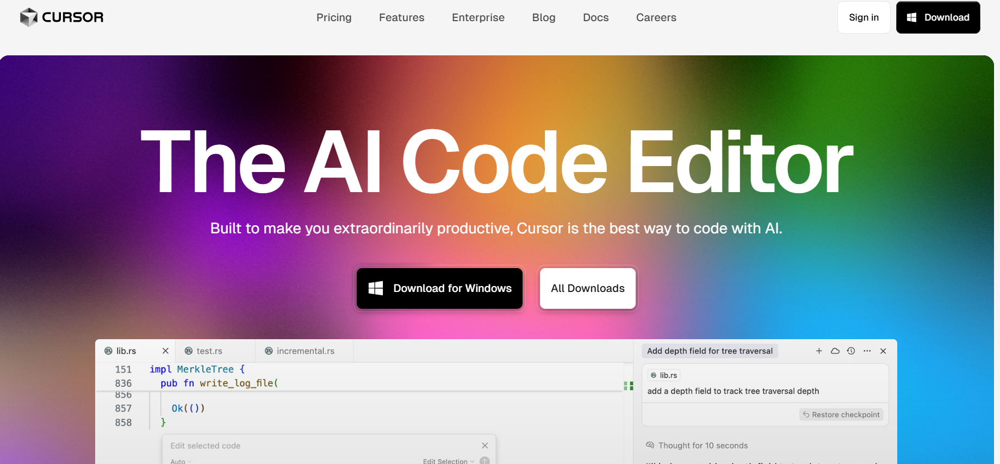

深度使用 AI 工具，去尝试**为你的工作生活提效**，这就够了。